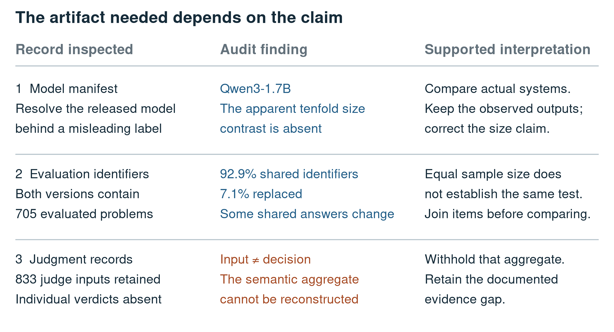
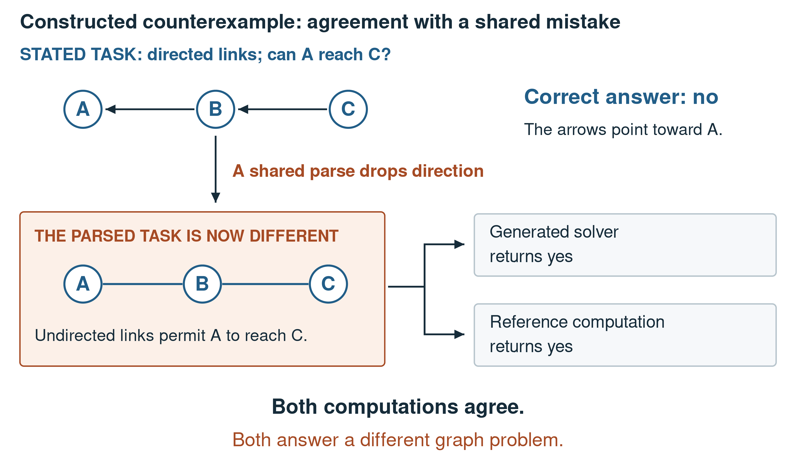

# When correct metrics support the wrong claim: auditing agent-assisted research software

## Abstract

Coding agents can help produce an experiment, its tests, and its explanation. Agreement between those artifacts is useful, but may preserve a shared mistake. We examine how an artifact audit changes the claims supported by one small-model research project. The system, SOP Lang, represents a generated solution as named computations with explicit dependencies and executes them in a runtime. We reconstruct 7,050 saved outputs from ten fine-tuning runs, then conduct targeted checks of base-model comparisons, evaluation populations, and missing judgment records. All original normalized exact labels reproduce. Interpretation changes nevertheless follow: a model-size contrast disappears after checking manifests, 7.1% of evaluation identifiers are replaced between two benchmark versions, and a base-model evaluation lacks completions for 45.7% of requests. Reapplying the same scoring rule to base and adapted outputs also exposes a distinction between reference-content recovery and semantic correctness. A useful positive result survives the audit: specialized commands increase normalized exact matching from 53.8% to 62.4%. We argue that research-software auditing should join counts to the identity, population, measurement rule, and mechanism required by the claim. This exploratory case does not estimate agent error rates or productivity. It supplies executable checks and a concrete method for retaining useful findings while correcting unsupported interpretations.

Keywords: empirical software engineering; coding agents; reproducibility; case study; research software; evidence provenance

## 1. Introduction

An experiment can run successfully and still be described incorrectly. A result table may accurately summarize the saved outputs while labeling the wrong model, comparing changed tasks, or assigning a mechanism the generated code never used. These are software-engineering problems because the evidence is distributed across programs, manifests, records, and prose. Checking any one of them in isolation can miss the contradiction.

Coding agents make this relationship particularly important. They may assist the data generator, reference solver, tests, evaluation scripts, and article. A mistake can become consistent across those outputs through reuse. Internal agreement then becomes a weak basis for confidence, even when the numerical experiment itself is real.

Our case is a project that fine-tunes small language models to compile word problems into SOP Lang programs. SOP Lang is introduced in Section 2; no prior knowledge of the language is assumed. The archive contains both useful improvements and unsupported interpretations of those improvements. It therefore permits a practical question: how can an audit preserve scientific value while determining which statements the records actually justify?

Three research questions guide the study. RQ1 asks which numerical findings can be reconstructed from saved artifacts. RQ2 asks which additional checks change their interpretation. RQ3 asks what audit procedure follows for similar agent-assisted research workflows. The intended contribution is a method of connecting claims to evidence, grounded in observed corrections. We do not compare agent-assisted work with a human-only team or estimate how frequently agents make these mistakes.

## 2. The system under study

### 2.1 A short introduction to SOP Lang

SOP Lang is a textual intermediate language for executable solutions. A program, called a circuit, contains named computations called wires. A declaration starts with `@name command` at the beginning of a line. The body continues to the next declaration, and the command defines how that body is interpreted. References such as `$slots` read another wire's value and establish dependencies.

For a problem asking for the cells in three packs of four, a complete program is:

```sop
@slots literal
{"packs":3,"perPack":4}

@answer jsEval
return $slots.packs * $slots.perPack;
```

The name `slots` identifies a wire whose `literal` command reads JSON. The name `answer` identifies a wire whose `jsEval` command evaluates JavaScript and returns 12. `$slots.packs` reads the field `packs` from the earlier value. The runtime evaluates the dependency before the consumer, regardless of declaration order. The caller chooses which output to request; `answer` and `slots` are dataset conventions rather than reserved keywords.

Figure 1 makes the division of responsibility concrete. The model selects multiplication and extracts 3 and 4. The runtime only executes that selection. A successful execution establishes that the program yields 12, not that 12 answers every possible statement containing those numbers.


**Fig. 1** The inspected research object is an executable interpretation. This constructed example illustrates the notation and is separately executed in the artifact checks

Specialized commands can move an algorithm into the runtime. For example, `graphPath` performs undirected reachability from an explicit edge list and endpoints. The model selects the operation and inputs instead of generating traversal code. Correct selection remains essential: an undirected command can correctly execute an incorrect interpretation of a directed problem.

### 2.2 How evidence is produced

The training pipeline constructs parameterized problem families. A family supplies a statement parser, reference computation, expected answer, and generated circuit. Candidate circuits are executed, selected input/output properties are asserted, and input perturbations test whether computed answers depend on the stated data. Accepted examples retain provenance and split information.

The evaluation then records the generated program, execution outcome, answer, expected answer, and classification. A model manifest identifies the base release and revision. A run manifest records evaluation conditions, and checkpoint selection has its own record. These artifacts answer different questions; a correct answer count cannot replace model identity or benchmark continuity.

The study includes ten primary archived fine-tuning runs with 705 items each. Targeted baseline analysis adds two earlier adapted systems and three direct-answer base evaluations where they test a specific comparison claim. This purposeful selection is not a census of every run ever attempted. The companion inventory identifies the exact source files and their hashes.

## 3. Method

### 3.1 Case-study design

We use an exploratory retrospective case study of one evolving research repository. Runeson and Höst's guidance motivates defining context, units of analysis, a chain of evidence, and validity limits (Runeson & Höst, 2009). The unit of analysis is a claim and the artifacts needed to support it. Item records supply observations for that claim; they are not independent research projects or independent samples of agent behavior.

The audit recounts outcomes, reruns comparison functions on saved answers, resolves model identity from nested manifests, joins evaluation populations by identifier, inspects generated command use, and checks whether judgment decisions survive. No neural generation or training is repeated. Historical statements are not reconstructed from invented prompts or judgments.

Coding agents participated in both the original development and this audit. That participation is a condition of the case and a reflexive limitation. Executable checks can make disagreement visible, but do not make this an independent human adjudication or external peer review.

### 3.2 Audit operations

Table 1 connects each claim class to a concrete operation. The procedure begins with the question being asked, not with a generic search for suspicious files. A comparison between base and adapted models needs shared populations and a common scoring rule. A mechanism claim needs evidence that the proposed mechanism was exercised.

Table 1. Claims require different evidence operations.

| Claim to assess | Artifact and operation | What the operation cannot establish |
| --- | --- | --- |
| A particular model was evaluated | Resolve base identity and revision from manifests | A filename alone does not identify capacity |
| A percentage summarizes saved outcomes | Recount unique records and reproduce labels | Correct aggregation does not validate the score's meaning |
| One system improves on another | Join identifiers and expected answers; align scoring | Equal denominators do not prove equal populations |
| A command explains improvement | Inspect generated command declarations and compare cases | Availability in the runtime does not prove execution |
| Semantic judging improves accuracy | Require per-item verdicts and their aggregation | Saved judge inputs do not supply missing decisions |
| A system transfers to new problems | Inspect family structure and benchmark use | Repeated instances are not independent structures |

Sandve and colleagues emphasize executable transformations and retained provenance (Sandve et al., 2013). Raji and colleagues treat auditing as a documented process across a development lifecycle (Raji et al., 2020). We adapt those ideas to the narrower question of what a research result supports. Kapoor and Narayanan's account of evaluation leakage is relevant to repeated benchmark consultation (Kapoor & Narayanan, 2023), but does not by itself establish direct training contamination in this project.

### 3.3 Outcome measures and interpretation rules

The primary evaluator separates syntax, graph validity, execution, and normalized exact matching. Exact matching applies specified Unicode, case, whitespace, and punctuation/prefix normalization. We reproduce those labels rather than silently replacing them with a new semantic judgment.

The base-model prose evaluator uses a different historical rule: every reference number must appear in the completion, or a non-numeric reference must appear under normalized containment. We call this reference-content matching. It can accept contradictory or wrongly assigned numbers. The audit applies it to both base and adapted outputs, and also applies exact matching to both, preserving the distinction between the measures.

Evidence is classified as reproduced, corroborated, historical-only, proposed, or unresolved. A missing decision stays missing. An interpretation may be narrowed even when its count reproduces exactly. We avoid inferential significance tests because repeated templates, adaptive benchmark use, and one run per condition do not supply an appropriate replication design.

## 4. Findings

### 4.1 RQ1: the saved outcome labels reproduce

All normalized exact labels in the primary 7,050-record reconstruction reproduce when the original comparator is reapplied. All selected programs pass syntax and graph checks, a 100% structural acceptance rate, while downstream outcomes differ substantially. This shows that neither source-code execution nor a polished table is the main evidential problem in these records. The difficult step is deciding what those outputs mean.

A constructive result survives. Comparing the general-code condition with the specialized-wire condition on 705 shared identifiers and unchanged expected answers, normalized exact matching rises from 53.8% to 62.4%. Procedural execution failures decline from 13.1% to 2.7% on 480 problems. We interpret this as a strong developmental signal that the target vocabulary matters. The audit retains it while stating the single-run design and missing early training manifest.

A claim that the added commands directly explain the entire gain requires more evidence. Only 8.3% of procedural outputs declare one of the new commands, while the procedural match rate improves by 13.1 percentage points. The command-use inspection narrows the mechanism account without negating the improvement. Changed training representations and other training differences remain possible contributors.

### 4.2 RQ2: identity and population checks change the comparison

An earlier interpretation treated an ambiguously named run as a 17B model. Its nested base metadata identifies Qwen3-1.7B. The proposed tenfold size contrast therefore disappears, even though the saved outcomes remain correct. The correction concerns the comparison being made, not the existence of the run.

Two benchmark versions both contain 705 items, but only 92.9% of their identifiers are shared. The later version replaces 7.1% of the earlier population, and 15.3% of shared identifiers have changed expected-answer strings. A reader seeing only aggregate percentages would have no reason to infer those changes. Population continuity must be reported before a score difference is interpreted as improvement or regression on a fixed test.

Figure 2 places these checks beside the judgment-record problem. Its rows show why different claims require different source artifacts rather than another copy of the same summary table.



**Fig. 2** Reproducing a count is only one audit operation. Identity, population continuity, and judgment traceability can each change the justified interpretation without changing the saved number

### 4.3 RQ2: a base comparison also depends on the scorer and serving result

For the two early Qwen2.5-Coder comparisons, all 585 base items join the corresponding adapted evaluations with unchanged expected answers. Under a common reference-content rule, the 0.5B workflow improves from 10.8% before adaptation to 44.4% after adaptation and execution; the 1.5B workflow improves from 5.1% to 61.4%. Under exact matching, the corresponding pairs are 0.0% to 44.1% and 0.2% to 55.0%.

These are useful results, but the difference between the two scorers is itself evidence. Prose may contain the right values without expressing the right relation, while exact matching may reject a valid paraphrase. The responsible claim is improved performance of the complete adapted workflow under two specified checks. It is not a validated semantic-accuracy gain or an isolated estimate of the executor's contribution. Prompting, fine-tuning, and generation budget also change.

The separate Qwen3 base evaluation returns no completion for 45.7% of 705 requests. Those missing responses remain in the denominator; they are not removed to improve the score. They must also not be described as observed reasoning mistakes. The source evaluator uses a 512-token generation cap, whereas compiled evaluations allow 2,048, and the retained errors do not establish an item-level causal diagnosis. The audit therefore rejects a clean capacity ranking from that base run.

Table 2 summarizes the interpretation changes that matter for a reader deciding whether to reproduce the work.

Table 2. Audit findings and their practical reporting consequences.

| Finding | Tempting interpretation | Supported reporting |
| --- | --- | --- |
| Ambiguous size label resolves to a 1.7B release | A small model beats a much larger model | Identify actual releases before comparing them |
| Only 92.9% of benchmark identifiers persist | Percentages describe the same test | Compare shared populations and disclose changed answers |
| Base evaluation has 45.7% missing completions | The base fails to reason on those problems | Report response availability separately from correctness |
| Content and exact checks give different rates | Either score measures general semantic accuracy | Name the measured property and retain both limitations |
| Historical judge inputs survive without verdicts | The semantic aggregate can be reproduced | Withhold the aggregate and preserve the missing-evidence record |

### 4.4 RQ2: mechanism and semantic claims need item-level evidence

A curriculum change improves a coalition family from 0% to 100% normalized exact match over 20 problems. Yet none of the successful programs declares the container commands invoked by the earlier explanation. The supported statement is curriculum-associated success on one coalition plan. Direct container execution and general mastery of a reasoning book do not follow.

A prior semantic summary has a different gap. The archive retains 833 judge inputs, but not the corresponding verdicts required for reaggregation. The files are disjoint batches, not multiple independent ratings of the same cases. The summary is excluded as outcome evidence. Its absence does not prove every judgment was wrong; it prevents reconstruction of the claim.

We separately implement restricted diagnostics for coalition tuples and dependency-join sentences. They recognize complete declared forms and abstain otherwise. For one 100-problem scheduling subset, the diagnostic yields 64% matches, 2% disagreements, 26% unclassified outputs, and 8% execution failures. This supplies a reproducible answer to a narrower question. It does not replace missing historical judge decisions or create an overall semantic score.

## 5. What the case implies for research software

### 5.1 RQ3: audit the inference, not only the arithmetic

The central finding is that a correct metric can support an incorrect claim. Model identity determines which systems were compared. Population continuity determines whether a percentage difference concerns the same problems. A scorer determines which property was measured. Generated programs help determine whether a proposed mechanism was used. These relationships must remain attached to the result.

The practical audit is therefore a sequence of claim-specific joins. Connect the run to its base manifest, the reported percentage to item outcomes, the pair of runs to shared identifiers and targets, and the explanation to generated commands. Each join can be automated partly, but selecting the right join requires understanding the claim. A script that only checks table sums cannot detect an unsupported model-size story.

This account also explains why audit should preserve positive work. The specialized-vocabulary result remains scientifically useful after the larger-model claim and unsupported semantic aggregate are removed. The resulting recommendation is more precise: investigate target-language design under better controls. The audit improves the question for the next experiment instead of treating every imperfection as a reason to discard the project.

### 5.2 Agreement within generated artifacts can share a cause

Figure 3 gives a constructed example of the independence problem. A directed graph is mistakenly parsed as undirected. Both a generated solver and a reference computation use that same parse and return the same wrong answer. More tests of the two implementations against one another can preserve the defect.



**Fig. 3** Constructed counterexample, not an observed frequency estimate. Agreement between implementations cannot repair a condition lost before either implementation receives the problem

The data pipeline's execution checks, assertions, and perturbations still have value: they catch failures in the properties they exercise. The additional requirement is to inspect shared origins. Gebru and colleagues' datasheets motivate recording data construction and intended use (Gebru et al., 2021); Mitchell and colleagues' model cards motivate recording model identity and evaluation conditions (Mitchell et al., 2019). Here that documentation should also identify which parsers and assumptions are reused by the supposed checks.

Messeri and Crockett discuss how AI can create illusions of understanding in science (Messeri & Crockett, 2024). This case offers a specific software pathway by which unwarranted confidence can arise: consistent artifacts can obscure an untested inference. We do not infer that participants experienced a measured cognitive effect, or that a human-only workflow would avoid the same problem.

### 5.3 Design the next experiment to separate explanations

A future wire-discovery study should freeze transfer families before using development failures to propose commands. Each command should state its supported inputs, exclusions, and reference implementation. Equivalent general-code and specialized-command targets should be compared under the same base revision, token budget, checkpoint rule, and decoding settings, across several seeds.

The audit record should include command-selection errors and direct command use, not just final correctness. An abstraction may improve generated JavaScript even when it is not directly called; a curriculum may help without exercising the runtime feature that inspired it. Distinguishing those possibilities turns an attractive explanation into a testable one. Dwork and colleagues' work on adaptive reuse supports reserving a separate confirmation stage (Dwork et al., 2015).

## 6. Threats to validity

Construct validity depends on the outcome definitions. Neither exact matching nor reference-content recovery establishes general semantic correctness. The restricted diagnostics cover only declared answer forms. Plan fingerprints index computational structure but do not prove semantic distance from training data.

Internal validity is limited by retrospective selection, changing curricula and target lengths, one run per condition, incomplete early manifests, and missing historical prompt bytes. The audit cannot make those controls exist after the experiment. Checkpoint selection and serving failures also affect interpretation of system comparisons.

External validity is limited to one synthetic-task research project. No agent-versus-human comparison, productivity measure, deployment outcome, or population error rate is estimated. Reliability is strengthened by executable reconstruction, source hashes, preserved decisions, and explicit unresolved evidence, but the audit itself remains agent-assisted and requires external scientific assessment.

## 7. Conclusion

The archive supports a real positive vocabulary result and also shows why accurate metrics are insufficient for accurate research claims. Checking model identity, population continuity, scoring semantics, and mechanism evidence changes what can be concluded. The useful outcome is a more specific scientific account, not simply a longer checklist.

For agent-assisted research, the practical requirement is to preserve the links that let a reader challenge each inference. Automation can produce and check those links. Human authors remain responsible for deciding what they establish and for correcting interpretations that the records cannot support.

## Data availability and declarations

Online Resource 1 contains the source inventory, experiment mappings, outcome reconstruction, baseline rescoring, restricted diagnostic decisions, and analysis scripts. Original records remain necessary for full reconstruction. Public access, author identities, affiliations, funding, and competing interests require completion before submission. Coding-agent assistance includes the research tooling, audit, and manuscript preparation; no independent peer review is claimed.

## References

Dwork, C., Feldman, V., Hardt, M., Pitassi, T., Reingold, O., & Roth, A. (2015). The reusable holdout: Preserving validity in adaptive data analysis. *Science*, 349(6248), 636-638. [https://doi.org/10.1126/science.aaa9375](https://doi.org/10.1126/science.aaa9375)

Gebru, T., Morgenstern, J., Vecchione, B., Vaughan, J. W., Wallach, H., Daumé, H., III, & Crawford, K. (2021). Datasheets for datasets. *Communications of the ACM*, 64(12), 86-92. [https://doi.org/10.1145/3458723](https://doi.org/10.1145/3458723)

Kapoor, S., & Narayanan, A. (2023). Leakage and the reproducibility crisis in machine-learning-based science. *Patterns*, 4(9), 100804. [https://doi.org/10.1016/j.patter.2023.100804](https://doi.org/10.1016/j.patter.2023.100804)

Messeri, L., & Crockett, M. J. (2024). Artificial intelligence and illusions of understanding in scientific research. *Nature*, 627(8002), 49-58. [https://doi.org/10.1038/s41586-024-07146-0](https://doi.org/10.1038/s41586-024-07146-0)

Mitchell, M., Wu, S., Zaldivar, A., Barnes, P., Vasserman, L., Hutchinson, B., Spitzer, E., Raji, I. D., & Gebru, T. (2019). Model Cards for Model Reporting. *Proceedings of the Conference on Fairness, Accountability, and Transparency*, 220-229. [https://doi.org/10.1145/3287560.3287596](https://doi.org/10.1145/3287560.3287596)

Raji, I. D., Smart, A., White, R. N., Mitchell, M., Gebru, T., Hutchinson, B., Smith-Loud, J., Theron, D., & Barnes, P. (2020). Closing the AI accountability gap: defining an end-to-end framework for internal algorithmic auditing. *Proceedings of the 2020 Conference on Fairness, Accountability, and Transparency*, 33-44. [https://doi.org/10.1145/3351095.3372873](https://doi.org/10.1145/3351095.3372873)

Runeson, P., & Höst, M. (2009). Guidelines for conducting and reporting case study research in software engineering. *Empirical Software Engineering*, 14(2), 131-164. [https://doi.org/10.1007/s10664-008-9102-8](https://doi.org/10.1007/s10664-008-9102-8)

Sandve, G. K., Nekrutenko, A., Taylor, J., & Hovig, E. (2013). Ten Simple Rules for Reproducible Computational Research. *PLoS Computational Biology*, 9(10), e1003285. [https://doi.org/10.1371/journal.pcbi.1003285](https://doi.org/10.1371/journal.pcbi.1003285)
