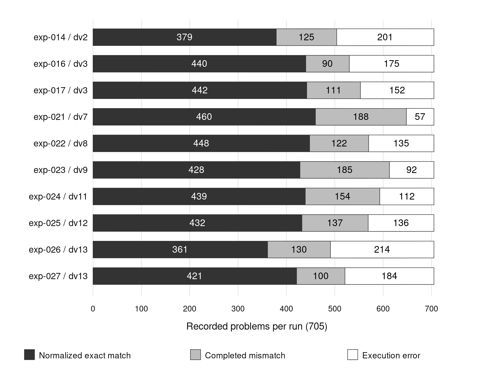

# Reconstructing a small-model compilation experiment: reusable evidence for discovering executable abstractions

## Abstract

Background: Small language models can emit executable programs, but reliable compilation depends on the operations available to them and on the quality of their training and evaluation data. Methods: We reconstruct ten developmental arms of the SOP Lang project from archived model metadata, training manifests, and 7,050 item-level evaluation records. The analysis separates normalized exact answer matching, execution failure, and two restricted retrospective checks of answer equivalence. Results: A specialized-wire transition increases normalized exact matches from 379/705 to 440/705 and reduces procedural execution errors from 63/480 to 13/480. A later Qwen3-1.7B curriculum reaches 460/705 matches; a more decomposed target representation lowers this to 448/705 and raises execution errors from 57 to 135. All ten arms pass syntax and graph checks on every evaluated item. Item-level joins identify population changes that constrain comparisons across dataset versions. Conclusions: The evidence supports further study of executable abstractions while exposing persistent limitations in small-model interpretation and coordination. We provide a reconstructable evidence package, explicit limits on data verification and agent-assisted analysis, and a prospective protocol for testing new wires on frozen transfer families. The current results are developmental, without multi-seed replication or a fresh confirmatory benchmark.

Keywords: open research; small language models; reproducible machine learning; executable abstractions; synthetic training data; negative results

## 1. Introduction

An executable intermediate representation can make a language-model answer easier to inspect. Instead of returning only a number or explanation, the model returns a program whose inputs and operations can be examined. PAL demonstrates this approach through program-aided language models (Gao et al., 2023), while Program of Thoughts separates numerical computation from generated reasoning (Chen et al., 2023). Neither arrangement removes the need to translate the statement correctly.

SOP Lang explores whether a small model can learn that translation when its target language exposes useful operations as named wires. A wire is a computational node with declared dependencies and a command contract. Some wires run generated JavaScript; others implement a narrower operation such as graph reachability, aggregation, or fraction reduction. The working hypothesis is that moving recurrent algorithms into tested operations can reduce generation failures. The countervailing risk is that the model may select an inappropriate operation or misstate its arguments.

The research question is what the archived experiment establishes about the usefulness and limits of executable abstractions when execution, answer comparison, and benchmark composition are examined separately. This matters because each failure calls for a different intervention: a new operation, better task interpretation, or a corrected evaluation contract. We provide a reconstructed experimental record and a research protocol built from its successes and failures. Item-level outcomes, configuration identities, and failed variants let readers examine the empirical basis of the abstraction hypothesis. The record distinguishes archived observations from new diagnostics and future experiments.

This emphasis follows Sandve and colleagues' argument for preserving the provenance and transformations behind computational results (Sandve et al., 2013). It also reflects a practical lesson from work on data cascades: data problems can propagate through later stages of a research workflow (Sambasivan et al., 2021). In this project, coding agents helped produce code, data tooling, analysis, and prose. Transparent records are therefore needed at every stage where one generated artifact is used to validate another.

## 2. Methods

### 2.1 Research design and evidence boundary

We analyze ten selected developmental arms, each with 705 archived evaluation items. The resulting 7,050 records are a retrospective census of those arm-specific files, not independent random samples from a population of reasoning tasks. The selection covers an early command-vocabulary change and the later curriculum variants used in the project's draft interpretations.

The analysis reconstructs outcomes from the original JSONL files. It checks unique item identifiers, recounts outcome classes, compares totals with the metric files, resolves base-model identity from nested manifests, and re-executes the original answer comparator on saved outputs. Pairwise joins expose changes to identifiers, oracle strings, and plan fingerprints. No model training or inference was repeated for this article.

We distinguish five evidential states. Reproduced results follow directly from item records and executable analysis. Corroborated interpretations also have supporting configuration or source evidence. Historical-only results occur in old reports but lack the records required for reconstruction. Proposed work has no measured outcome. Unresolved facts remain explicitly unresolved. The companion claim ledger applies these distinctions to the principal manuscript statements.

### 2.2 System and training-data construction

The student maps a word problem to an SOP Lang circuit. Literal wires contain values extracted from the statement, and computation wires derive the answer. The executor checks syntax and dependencies, validates the active graph, evaluates commands under resource budgets, and records completion or failure. The runtime's contract is about the emitted circuit; it cannot decide whether a coherent circuit expresses the intended meaning of the original sentence.

Teaching examples originate in parameterized families. A family includes a reference parse, reference computation, circuit generator, expected answer, and provenance. The pipeline executes candidate circuits before acceptance. Dataset verification checks structural requirements and perturbs literal inputs to detect outputs that fail to depend on their stated data. Probe assertions check selected properties inside generated computations. When a source answer is not determined by the statement, the pipeline's documented policy requires an explicit clarification, a declared computed answer, or rejection rather than an unexplained lookup.

These checks represent a deliberate attempt to improve synthetic-data quality. They are not independent proofs of task semantics. The parser, reference computation, and generated circuit can share a misconception; some categorical outputs legitimately remain unchanged under the available perturbations. The article therefore uses “checked” for the data pipeline and reserves stronger claims for specifically stated properties.

The pipeline's use of family and plan identities is relevant to compositional generalization. Lake and Baroni show why success on familiar constructions should be distinguished from systematic recombination (Lake & Baroni, 2018). Here, a plan fingerprint indexes a computational form, but cannot by itself certify semantic distance from training data. Repeated benchmark inspection also limits the interpretation of nominal holdout performance.

### 2.3 Benchmark composition and version changes

The dv7 slice has 480 procedural items and 225 book-derived items. Its procedural subset covers 12 plan fingerprints. The seven book-derived subsets contribute 10 adult-reasoning, 50 common-sense, 100 dependency-join, 10 logical-reasoning, 10 mathematical, 25 scientific-reasoning, and 20 coalition cases. Together they contribute 16 fingerprints, ten from the mathematical subset and one from each other subset.

Thus, 705 items represent 28 plan fingerprints, rather than 705 independent forms of reasoning. In particular, the 20 coalition items do not cover an entire source book. We report this composition because aggregate performance is strongly weighted toward procedural problems and because family-level failures can disappear inside a single overall score.

The development team inspected the nominal holdout across successive revisions. Dwork and colleagues explain why adaptive reuse can compromise a holdout's role as independent confirmation (Dwork et al., 2015). We consequently call it a development benchmark. Relative to dv7, dv13 retains 655 identifiers, removes 50, and adds 50. Among retained identifiers, 100 oracle strings and 147 plan fingerprints change. A stable denominator does not make these versions an unchanged evaluation population.

### 2.4 Model identity, training, and selection

The early exp-014 and exp-016 arms use Qwen2.5-Coder-1.5B-Instruct (Qwen, n.d.-b). The later series uses Qwen3-1.7B except for exp-026, which uses Qwen2.5-Coder-0.5B-Instruct (Qwen, n.d.-c) (Qwen, n.d.-a). Model identities and revisions are taken from the archived base manifests.

Later curriculum arms use full fine-tuning, AdamW, learning rate 0.0001, seed 3407, two epochs, effective batch size 32, bfloat16 precision, and a maximum sequence length of 4,096. Checkpoint selection follows the archived validation procedure. Evaluation uses the selected GGUF artifact, greedy decoding, a 2,048-token generation cap, and one task attempt. Infrastructure transport recovery does not constitute a semantic retry. Token exposure varies with the exported targets; for example, dv7 records 6,648,719 target tokens and dv8 records 6,782,314.

Table 1 provides compact identities for the central comparisons. Finish times refer to training completion, not article preparation. The exp-014 time is approximate because its training manifest is missing. Full revisions, data snapshots, selected checkpoints, token counts, and available training settings are retained in the machine-readable evidence table.

Table 1. Identity of the principal compared systems. All timestamps are UTC in 2026.

| Arm | Base model | Data | Training finish | Selected step |
| --- | --- | --- | --- | --- |
| exp-014 | Qwen2.5-Coder-1.5B-Instruct | dv2 | 23 Sep, 17:10:57, approximate | 450 |
| exp-016 | Qwen2.5-Coder-1.5B-Instruct | dv3 | 24 Sep, 08:14:49 | 600 |
| exp-021 | Qwen3-1.7B | dv7 | 25 Sep, 15:44:50 | 450 |
| exp-022 | Qwen3-1.7B | dv8 | 25 Sep, 20:45:14 | 450 |
| exp-026 | Qwen2.5-Coder-0.5B-Instruct | dv13 | 26 Sep, 20:07:03 | 660 |
| exp-027 | Qwen3-1.7B | dv13 | 27 Sep, 00:07:16 | 600 |

### 2.5 Measurements and analysis

The original outcome ladder distinguishes transport, wrapper, parse, graph, execution, and answer-comparison failures. In the selected slices, all items pass the stages preceding execution. Completed answers are evaluated by normalized exact matching, which performs Unicode, case, whitespace, punctuation, and answer-prefix normalization before equality. This is a reproducible text comparator, not a general semantic judgment.

We report counts, per-subset results, and paired changes. We do not add inferential confidence intervals because the observations are a fixed developmental collection with repeated templates and one training run per condition. Such intervals would conceal the absence of an appropriate sampling and replication design.

Two additional analyses examine specific comparator failures. The coalition diagnostic accepts complete lists of coalition/count tuples, canonicalizes ordering, and rejects duplicates. The dependency-join diagnostic accepts complete duration-and-feasibility sentences from a fixed grammar. It recognizes one explanatory suffix from the oracle. Both abstain on unsupported output forms and preserve item-level decisions. They were designed retrospectively and remain separate from the original benchmark metric.

## 3. Results

### 3.1 Reconstructed outcomes and positive abstraction evidence

Reconstructed outcome totals agree with the archived metrics, and reapplying the original comparator reproduces every stored match/mismatch label. Table 2 includes positive and negative arms. Syntax and graph checks pass on 705/705 items in each arm, even though execution and answer outcomes differ substantially.

Table 2. Outcome reconstruction, with 705 evaluated items per arm. “Mismatch” means a completed answer that fails normalized exact comparison.

| Arm | Match | Mismatch | Execution error |
| --- | --- | --- | --- |
| exp-014 | 379 | 125 | 201 |
| exp-016 | 440 | 90 | 175 |
| exp-017 | 442 | 111 | 152 |
| exp-021 | 460 | 188 | 57 |
| exp-022 | 448 | 122 | 135 |
| exp-023 | 428 | 185 | 92 |
| exp-024 | 439 | 154 | 112 |
| exp-025 | 432 | 137 | 136 |
| exp-026 | 361 | 130 | 214 |
| exp-027 | 421 | 100 | 184 |

The early specialized-wire transition increases total matches from 379/705 to 440/705. On identical identifiers and oracle strings, 377 items match in both arms, 63 only in exp-016, two only in exp-014, and 263 in neither. Procedural matches rise from 377/480 to 440/480, while procedural execution errors fall from 63/480 to 13/480. This is the clearest positive signal for moving recurrent graph, aggregation, and fraction operations into specialized commands.

Only 40 procedural exp-016 completions directly declare one of these new commands, fewer than the 63 additional procedural matches. A direct-use explanation is therefore incomplete. The data are compatible with broader effects of changed targets or training exposure, and the missing exp-014 training manifest prevents establishing that every other condition was identical.

Figure 1 shows the full outcome partition, keeping failed variants visible alongside successful ones.

Figure 1. Development outcomes reconstructed from item records. Each bar contains 705 items, but dataset versions are not all identical populations. The figure supports descriptive comparison, not a continuous learning curve.

### 3.2 Negative results and persistent limits

The dv7 Qwen3 arm reaches 460/705 matches and 648/705 completed executions. The dv8 arm, which changes target decomposition, reaches 448/705 matches and 570/705 completed executions. Execution errors rise from 57 to 135 despite unchanged evaluation identifiers and oracle strings. The paired comparison has 446 joint matches, 14 matches exclusive to dv7, and two exclusive to dv8.

Later curriculum changes also fail to exceed dv7 under the original comparator: dv9 yields 428/705, dv11 yields 439/705, and dv12 yields 432/705. These results show that plausible representational changes can introduce costs. They do not establish that the development path was optimal or that an alternative training budget would produce the same ranking.

Performance remains uneven. In exp-021, procedural items contribute 438/480 matches, while the seven book-derived subsets together contribute 22/225. Twenty of those are the coalition cases and two are mathematical cases. The difference limits any claim about broad reasoning ability even when the overall exact-match score reaches 65.2%, or 460/705.

The dv13 smaller-model comparison records 361/705 matches for Qwen2.5-Coder-0.5B-Instruct and 421/705 for Qwen3-1.7B on the same dv13 items and oracles. Because model family and pretraining change alongside size, this is not a controlled scaling experiment. It identifies a difference between two archived trained systems.

### 3.3 Comparator diagnostics and command use

Table 3 reports the restricted diagnostics. They show why completed mismatches deserve inspection while keeping unsupported cases visible. A coalition answer can enumerate the correct coalition/count pairs in a different order or separator style. A dependency-join answer can state the correct time and verdict using a phrase absent from the original oracle wording.

Table 3. Retrospective diagnostic outcomes. Outside-grammar answers remain unclassified.

| Subset and arm | Original match | Restricted match | Restricted mismatch | Outside grammar | Execution failure |
| --- | --- | --- | --- | --- | --- |
| Coalitions, exp-027, n = 20 | 5 | 20 | 0 | 0 | 0 |
| Dependency joins, exp-021, n = 100 | 0 | 64 | 2 | 26 | 8 |

The two diagnostics have different grammars and item populations. Their counts are not combined into a general semantic accuracy estimate.

Exp-021 matches 20/20 coalition cases where exp-017 matches 0/20. Inspection of the 20 successful completions finds no container-family declarations. The observation therefore supports a curriculum association without identifying direct container execution as its mechanism. The sample covers one coalition plan.

## 4. Discussion

### 4.1 What the evidence supports

The archive supports treating executable vocabulary as a serious experimental variable. Moving algorithmic work into specialized wires coincides with fewer execution failures and more correct procedural answers. The finding is compatible with the broader motivation for reusable abstractions in DreamCoder (Ellis et al., 2021), but this project does not implement that system's automatic library-learning procedure.

The evidence also rejects two overly broad inferences. First, structural validity does not establish task correctness: every selected arm passes syntax and graph checks while many outputs fail later. Second, adding structure does not guarantee improvement: the dv8 target split increases execution errors. A useful wire should remove recurring implementation burden without creating a larger command-selection or argument-binding burden.

The failures are scientific evidence about the current systems. The student models learn recognizable circuit form more reliably than they generalize across the evaluated task structures. Some failures belong to program execution, others to interpretation, and others to answer comparison. These distinctions are more informative for future design than a single claim that the model “can” or “cannot” reason.

### 4.2 Agent assistance and epistemic responsibility

Coding agents assisted the research and the preparation of this article. Their involvement can make experiments easier to construct and inspect, but no productivity gain is measured here. The epistemic concern is correlated error: an agent can implement a mistaken reference rule, test it against a matching circuit, and describe the agreement as validation. Human review must examine the relation to the task, not only agreement between generated artifacts.

Messeri and Crockett's analysis of AI and scientific understanding provides a useful conceptual warning (Messeri & Crockett, 2024). In this study, the concrete response is to retain uncertainty at the point where it arises. Model identity comes from the base manifest, comparisons retain their population boundaries, and mechanism claims depend on the generated commands. A future wire is described as a proposal until its experiment exists.

### 4.3 A prospective wire-discovery protocol

Future experiments should freeze a new transfer benchmark before candidate design. Development traces can identify repeated algorithmic failures, but the frozen families must remain outside that process. Candidate wires should specify inputs, outputs, excluded cases, implementation, and adversarial tests. A dependency-join scheduler, a units-and-rates operation, and a constraint interface are plausible candidates, not current findings.

The comparison should hold constant base revision, training-token budget, checkpoint selection, and decoding settings, while contrasting the new command against an equivalent general-code target. Several seeds should quantify run variability. Reporting should include direct command use, selection errors, extraction errors, execution failures, answer correctness, generated length, and measured computational cost. No current result establishes that a new command lowers energy use or total research cost.

Figure 2 summarizes the proposed separation between development and confirmation.

Figure 2. Proposed experiment sequence. This prospective design addresses limitations of the current archive and has not yet been executed.

## 5. Reuse and reproducibility

The companion artifact (SOP Lang research artifact, 2026) separates raw inputs, derived evidence, manuscripts, and audit records. The extraction script reads archived item files and manifests, emits a machine-readable result table, and records source hashes. Restricted parser decisions are preserved per item. Figure code reads the result table rather than duplicating numbers by hand. Markdown sources and editable DOCX files derive from a shared bibliography ledger.

Table 4 describes the reusable components and their limits. Dataset documentation follows the motivation of datasheets (Gebru et al., 2021), while model identity and intended-use limitations follow the concerns addressed by model cards (Mitchell et al., 2019). These are documentation practices, not certifications of correctness.

Table 4. Reuse map for the accompanying evidence package.

| Component | Reuse supported | Boundary |
| --- | --- | --- |
| Results and source hashes | Reconstruct counts and identify the exact inputs | Hashes do not provide missing source files |
| Pairwise comparisons | Check item and oracle continuity | Similar identifiers do not prove semantic identity |
| Restricted decisions and parsers | Reproduce the two comparator diagnostics | Unsupported prose remains unclassified |
| Figure sources | Regenerate numerical graphics | Descriptive charts do not establish causality |
| Claim and bibliography ledgers | Inspect support and stated limitations | Self-audit does not replace external review |
| Archived model/training metadata | Identify evaluated systems | The missing early manifest limits replication |

Local reconstruction requires the original repository's archived evaluation and training metadata. Public reuse requires depositing the necessary source records or documenting a legitimate restriction. A repository URL or hash alone is insufficient for open data if the records are unavailable. Source books remain separate materials with their own rights status; the evidence package does not grant new redistribution rights over them.

## 6. Limitations and conclusions

The study is retrospective, synthetic, single-seed, and development-driven. It lacks an independently designed fresh test, a matched direct-answer baseline, and a controlled larger-model comparison. Two restricted diagnostics improve understanding of specific scoring errors but do not supply general semantic accuracy. The analysis reconstructs archived evaluation, not neural training.

Within those limits, the positive abstraction result and the negative decomposition result are both reproducible. They justify a focused research programme on discovering new wires and measuring the boundaries of their usefulness. The open contribution is the evidence needed to challenge that interpretation as well as reproduce it.

## Data and software availability

The accompanying local artifact contains the scripts, derived tables, source-hash manifest, restricted diagnostic decisions, and manuscript sources described above. The original item records and model manifests are required for complete reconstruction. An immutable public deposit and its persistent identifier have not yet been established in this manuscript; these must be completed before an open-data submission. Access to the local workspace is not represented as public availability.

## Author contributions, funding, and competing interests

Contributor identities and roles, funding or grant information, and competing-interest declarations require author confirmation. No European Union grant or institutional eligibility is inferred from the project location. Coding-agent assistance is disclosed in Section 4.2; human authors remain responsible for the scientific content and submission declarations.

## References

Chen, W., Ma, X., Wang, X., & Cohen, W. W. (2023). Program of Thoughts Prompting: Disentangling Computation from Reasoning for Numerical Reasoning Tasks. *Transactions on Machine Learning Research*. [https://openreview.net/forum?id=YfZ4ZPt8zd](https://openreview.net/forum?id=YfZ4ZPt8zd)

Dwork, C., Feldman, V., Hardt, M., Pitassi, T., Reingold, O., & Roth, A. (2015). The reusable holdout: Preserving validity in adaptive data analysis. *Science*, 349(6248), 636-638. [https://doi.org/10.1126/science.aaa9375](https://doi.org/10.1126/science.aaa9375)

Ellis, K., Wong, C., Nye, M., Sablé-Meyer, M., Morales, L., Hewitt, L., Cary, L., Solar-Lezama, A., & Tenenbaum, J. B. (2021). DreamCoder: bootstrapping inductive program synthesis with wake-sleep library learning. *Proceedings of the 42nd ACM SIGPLAN International Conference on Programming Language Design and Implementation*, 835-850. [https://doi.org/10.1145/3453483.3454080](https://doi.org/10.1145/3453483.3454080)

Gao, L., Madaan, A., Zhou, S., Alon, U., Liu, P., Yang, Y., Callan, J., & Neubig, G. (2023). PAL: Program-aided Language Models. *Proceedings of Machine Learning Research*, 202, 10764-10799. [https://proceedings.mlr.press/v202/gao23f.html](https://proceedings.mlr.press/v202/gao23f.html)

Gebru, T., Morgenstern, J., Vecchione, B., Vaughan, J. W., Wallach, H., Daumé, H., III, & Crawford, K. (2021). Datasheets for datasets. *Communications of the ACM*, 64(12), 86-92. [https://doi.org/10.1145/3458723](https://doi.org/10.1145/3458723)

Lake, B., & Baroni, M. (2018). Generalization without Systematicity: On the Compositional Skills of Sequence-to-Sequence Recurrent Networks. *Proceedings of Machine Learning Research*, 80, 2873-2882. [https://proceedings.mlr.press/v80/lake18a.html](https://proceedings.mlr.press/v80/lake18a.html)

Messeri, L., & Crockett, M. J. (2024). Artificial intelligence and illusions of understanding in scientific research. *Nature*, 627(8002), 49-58. [https://doi.org/10.1038/s41586-024-07146-0](https://doi.org/10.1038/s41586-024-07146-0)

Mitchell, M., Wu, S., Zaldivar, A., Barnes, P., Vasserman, L., Hutchinson, B., Spitzer, E., Raji, I. D., & Gebru, T. (2019). Model Cards for Model Reporting. *Proceedings of the Conference on Fairness, Accountability, and Transparency*, 220-229. [https://doi.org/10.1145/3287560.3287596](https://doi.org/10.1145/3287560.3287596)

Qwen. (n.d.-a). *Qwen2.5-Coder-0.5B-Instruct* [Model card]. Hugging Face. Retrieved September 28, 2026, from [https://huggingface.co/Qwen/Qwen2.5-Coder-0.5B-Instruct](https://huggingface.co/Qwen/Qwen2.5-Coder-0.5B-Instruct)

Qwen. (n.d.-b). *Qwen2.5-Coder-1.5B-Instruct* [Model card]. Hugging Face. Retrieved September 28, 2026, from [https://huggingface.co/Qwen/Qwen2.5-Coder-1.5B-Instruct](https://huggingface.co/Qwen/Qwen2.5-Coder-1.5B-Instruct)

Qwen. (n.d.-c). *Qwen3-1.7B* [Model card]. Hugging Face. Retrieved September 28, 2026, from [https://huggingface.co/Qwen/Qwen3-1.7B](https://huggingface.co/Qwen/Qwen3-1.7B)

Sambasivan, N., Kapania, S., Highfill, H., Akrong, D., Paritosh, P., & Aroyo, L. M. (2021). “Everyone wants to do the model work, not the data work”: Data Cascades in High-Stakes AI. *Proceedings of the 2021 CHI Conference on Human Factors in Computing Systems*, 1-15. [https://doi.org/10.1145/3411764.3445518](https://doi.org/10.1145/3411764.3445518)

Sandve, G. K., Nekrutenko, A., Taylor, J., & Hovig, E. (2013). Ten Simple Rules for Reproducible Computational Research. *PLoS Computational Biology*, 9(10), e1003285. [https://doi.org/10.1371/journal.pcbi.1003285](https://doi.org/10.1371/journal.pcbi.1003285)

*SOP Lang research artifact: Audited experiment records and reconstruction scripts*. (2026). Supplementary material accompanying this manuscript; snapshot dated September 28, 2026. Public persistent identifier pending.
