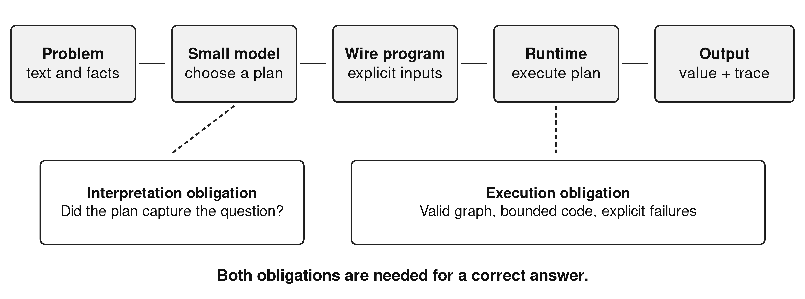
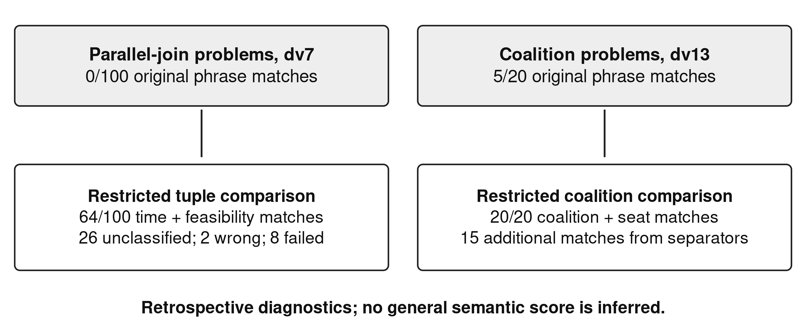
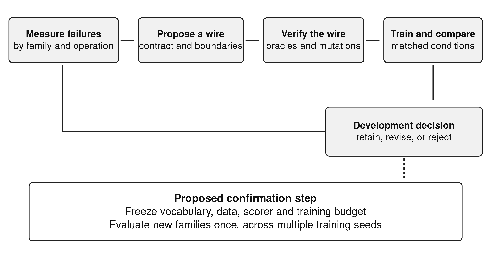

# Learning to select executable abstractions: evidence and limits from small language models compiling word problems

## Abstract

Small language models can delegate calculation to a program executor, but they must still translate a problem into the right program. We investigate whether the available programming vocabulary changes this remaining difficulty. A retrospective study of SOP Lang examines ten archived fine-tuning arms and reconstructs outcomes from 7,050 item records. In the most direct vocabulary comparison, Qwen2.5-Coder-1.5B-Instruct increases normalized exact matches from 379/705 to 440/705 after the introduction of specialized graph, aggregation, and fraction commands; execution errors on the 480 procedural items fall from 63 to 13. This is a substantial descriptive improvement, although one run per condition and incomplete training metadata prevent a clean causal estimate. A later Qwen3-1.7B curriculum reaches 460/705 matches, while splitting targets into more wires reduces this to 448/705 and raises execution errors from 57 to 135. All ten arms pass syntax and graph checks on all evaluated items. Two restricted semantic diagnostics expose answer-format penalties without establishing a general semantic score. The results distinguish executable syntax, successful execution, and correct interpretation, with implications for the limits of checked, agent-assisted data construction. We propose a preregisterable research programme for discovering useful wire abstractions, with frozen transfer tasks, paired comparisons, and explicit accounting for selection difficulty.

Keywords: small language models; program synthesis; executable reasoning; abstraction learning; compositional generalization; reproducibility

## 1. Introduction

A small language model asked to solve a word problem faces two different tasks. It must identify the quantities, relations, and operations intended by the statement, and it must carry out those operations. Program-aided methods delegate the second task to an interpreter. Gao and colleagues' PAL makes this separation explicit by generating executable programs [@pal]. Chen and colleagues' Program of Thoughts similarly separates numerical computation from language-model reasoning [@pot]. These methods establish the value of execution. They leave open which language a small model should learn to generate.

That choice can change the learning problem. Writing a graph traversal requires the model to emit a queue, a visited set, termination conditions, and a return value. Calling a graph command requires the model to identify an edge list and two nodes. The latter removes several opportunities for transcription error, but adds a selection obligation: the command must have the semantics the problem requires. An undirected reachability command is inappropriate for a weighted shortest-path problem even if the resulting program is syntactically valid.

This article studies that trade-off in SOP Lang, a language whose named computational components are called wires. The student compiles a problem into a dependency graph; a deterministic executor evaluates the graph. Some wires execute generated JavaScript, while others expose narrower operations with explicit contracts. The empirical question is whether more abstract operations help small models produce correct executable solutions, and where that assistance stops.

The contribution is an exploratory analysis of ten development arms, with a strong positive vocabulary signal and several informative failures. We reconstruct item outcomes and model identities from archived records, then examine the comparisons most relevant to representation learning. This makes it possible to distinguish a promising vocabulary intervention from broader claims about model capacity that the experimental design cannot resolve.

Three questions organize the analysis. Does adding specialized commands coincide with fewer execution failures and more correct answers? Does decomposing targets into more wires necessarily help? Which apparent failures reflect interpretation, execution, or an overly restrictive answer comparator? These questions support a research direction in vocabulary discovery without implying that a suitable vocabulary eliminates the limits of small models.

## 2. Related work and conceptual model

Program synthesis treats the search space and the specification as central design choices [@synthesis]. SOP Lang adopts that perspective: its command vocabulary defines the available search space, while the natural-language problem and task oracle provide imperfect specifications. The distinction matters because an executor can enforce the language contract without verifying that the natural-language interpretation is correct.

Ellis and colleagues' DreamCoder learns reusable program abstractions and uses them to guide subsequent synthesis [@dreamcoder]. The present system shares the motivation for reusable operations but does not implement DreamCoder's library-learning algorithm. Human-directed development, assisted by coding agents, introduced the commands evaluated here. Learning which new wires to propose and when to retain them remains future work. We use “abstraction learning” only for the broader research problem; the current experiment measures a manually revised vocabulary and curriculum.

Lake and Baroni's compositional-generalization experiments show why strong performance on familiar forms need not imply reliable recombination [@scan]. Our benchmark also contains repeated problem families. A large number of instances can therefore represent few distinct computational plans. We report family composition and treat transfer across plans separately from performance on additional numerical instances.

Let x denote a problem statement, C a command catalogue, G the generated circuit, and E the executor. The model produces G = M(x, C), and the system returns E(G). Correctness requires both that G express the intended task and that execution implement G correctly. Changing C can shorten G and reduce implementation errors while making command selection more demanding. The resulting hypothesis is conditional: a useful abstraction removes recurrent implementation work while preserving distinctions the model can select reliably.

Figure 1 identifies the separate obligations at the model and runtime boundaries.

Figure 1. The compilation boundary. Execution checks constrain the program's behavior; they do not establish that the program represents the statement correctly.

## 3. Materials and methods

### 3.1 Study design and units of analysis

We performed a retrospective census of the archived holdout records for ten selected fine-tuning arms. Each arm contributes 705 unique item identifiers, giving 7,050 records. Selection covers the early specialized-wire comparison and the later curriculum series discussed in the project's article drafts. It is a bounded developmental case study, not a systematic search over all possible models, vocabularies, or training settings.

The primary unit is an item outcome within an arm. For comparisons we join records by item identifier and inspect oracle and plan-fingerprint changes. We do not treat the 7,050 records as independent observations. Items recur across arms, and many share a generator and computational plan. There is one archived training run per reported condition. Consequently, we report counts and paired differences without confidence intervals or significance tests that would imply an unsupported population-sampling or seed-replication model.

### 3.2 Training data and evaluation composition

The teaching pipeline constructs problem families from source books and procedural generators. A family supplies a reference parse, a computation, an answer, and a circuit. Accepted circuits are executed and compared with expected answers. Dataset verification checks structural requirements and perturbs compiled inputs to detect answers that do not depend on them. Probe assertions check selected input and output properties. These mechanisms provide executable checks; shared assumptions between a family parser, reference computation, and generated circuit can still produce correlated errors.

Table 1 describes the dv7 evaluation slice. Its 480 procedural items dominate the aggregate. The remaining 225 items come from seven book-derived subsets. A book label identifies provenance, not broad coverage of the book: the 20 world-as-a-system cases use one coalition plan. Plan fingerprints are a useful structural index, not a proof that two tasks have identical semantics.

Table 1. Composition of the dv7 development benchmark.

| Subset | Items | Distinct plan fingerprints |
| --- | --- | --- |
| Procedural problems | 480 | 12 |
| Adult reasoning | 10 | 1 |
| Common sense | 50 | 1 |
| Dependency joins, decompose-to-solve | 100 | 1 |
| Logical reasoning | 10 | 1 |
| Mathematical thinking | 10 | 10 |
| Scientific reasoning | 25 | 1 |
| Coalitions, world-as-a-system | 20 | 1 |
| Total | 705 | 28 |

The nominal holdout informed successive development decisions. It is therefore a development benchmark, even where its plan fingerprints were excluded from a particular training export. Adaptive reuse can make performance on a repeatedly inspected test set an optimistic guide to new data [@dwork]. We do not claim a sealed confirmatory test. Dataset version dv13 also changes the evaluation population: relative to dv7, 655 identifiers remain, 50 disappear, 50 are added, and 100 oracle strings change among the shared identifiers. We avoid interpreting their aggregate difference as a controlled regression on a fixed test.

### 3.3 Models, training, and inference

The early vocabulary comparison uses Qwen2.5-Coder-1.5B-Instruct in exp-014 and exp-016. Later arms use Qwen3-1.7B, except exp-026, which uses Qwen2.5-Coder-0.5B-Instruct. These are model-family names, not independently recounted parameter totals. The official model cards identify the three base releases [@qwen15] [@qwen3] [@qwen05]; the archived manifests supply the revisions used here.

The later curriculum runs use full fine-tuning with AdamW, learning rate 0.0001, two epochs, seed 3407, effective batch size 32, maximum sequence length 4,096, and bfloat16 precision. Checkpoint selection uses the recorded validation procedure; the selected step varies between arms. Evaluation uses greedy generation, a 2,048-token output limit, and one task attempt. A transport retry is infrastructure recovery, not a second semantic attempt. The analysis uses the saved outputs of the selected GGUF exports and does not rerun model inference.

Training exposure is not identical merely because the recipe is shared. For example, the later dv7 and dv8 runs record 6,648,719 and 6,782,314 target tokens seen, respectively. The exp-014 training manifest is absent; its evaluation manifest supports base identity and an approximate finish time, but cannot establish that every training variable was held fixed. Exact model revisions, selected checkpoints, dataset snapshots, and finish times are preserved in the supplementary evidence table.

### 3.4 Outcome reconstruction and restricted diagnostics

The original evaluator distinguishes transport, wrapper, parse, graph, execution, and answer-comparison outcomes. No transport, wrapper, parse, or graph failures occur in these ten selected slices. We distinguish completed execution from a normalized exact answer match. The comparator applies Unicode normalization, case folding, whitespace and punctuation normalization, and limited answer-prefix removal before equality. It does not establish semantic equivalence. Reapplying this comparator to all archived completed outputs reproduces every stored match/mismatch label.

Two new, deliberately restricted diagnostics examine formatting effects. A coalition parser accepts only complete lists of coalition identifiers and seat counts, canonicalizes member and list order, and rejects duplicate coalitions. A dependency-join parser accepts complete sentences expressing a completion time and a feasibility verdict, with a fixed set of synonymous verdict phrases. It recognizes one known explanatory suffix. Unsupported prose remains unclassified. These diagnostics neither rescue execution failures nor infer meaning from a bag of numbers.

Only original normalized exact outcomes and the two reproducible restricted diagnostics enter the reported results. We do not extrapolate a general semantic score from the diagnostic subsets.

## 4. Results

### 4.1 A positive signal from specialized wires

Table 2 reports the primary outcomes. The early vocabulary transition increases matches by 61 items, from 379/705 to 440/705, an 8.7 percentage-point difference. The paired comparison retains all 705 identifiers and unchanged oracle strings. Both arms match 377 items; exp-016 alone matches 63, exp-014 alone matches two, and neither matches 263. Forty plan fingerprints change between the evaluated records, consistent with a representation intervention.

The procedural subset supplies the clearest mechanism-related evidence. Matches increase from 377/480 to 440/480, while execution failures decrease from 63/480 to 13/480. The revised vocabulary includes `graphPath`, `aggregate`, and `fraction`, which place traversal, reduction, and ratio-normalization code inside tested commands. Forty procedural completions in exp-016 declare at least one of these commands. The aggregate gain exceeds that direct-use count, so the observations do not identify command execution as the sole mediator; changed training targets can also affect programs that continue to use JavaScript.

Table 2. Selected comparisons relevant to vocabulary, decomposition, and model choice. Counts use 705 items per row. “Other completed” means execution completed but normalized exact comparison failed. The companion table contains all ten arms.

| Arm | Base model | Data | Match | Other completed | Execution error |
| --- | --- | --- | --- | --- | --- |
| exp-014 | Qwen2.5-Coder-1.5B | dv2 | 379 | 125 | 201 |
| exp-016 | Qwen2.5-Coder-1.5B | dv3 | 440 | 90 | 175 |
| exp-021 | Qwen3-1.7B | dv7 | 460 | 188 | 57 |
| exp-022 | Qwen3-1.7B | dv8 | 448 | 122 | 135 |
| exp-026 | Qwen2.5-Coder-0.5B | dv13 | 361 | 130 | 214 |
| exp-027 | Qwen3-1.7B | dv13 | 421 | 100 | 184 |

### 4.2 More wires do not imply better compilation

The later dv7 curriculum reaches 65.2% normalized exact match, 460/705, and completes execution on 648/705 items. Its dv8 successor changes target decomposition while preserving the evaluated identifiers and oracle strings. It matches 448/705 and completes 570/705. Execution errors increase from 57 to 135. The paired table contains 446 joint matches, 14 matches exclusive to dv7, and two exclusive to dv8.

This result rejects the simple development heuristic that more explicit intermediate wires necessarily help this student. Splitting a computation can reduce the length of an individual body while adding variable bindings and cross-wire dependencies. The observed error increase is consistent with that burden, but this retrospective comparison does not separately estimate the effects of sequence length, checkpoint selection, or curriculum exposure. It is evidence against an unconditional modularity claim, not against modular programming generally.

### 4.3 Structural validity leaves substantial task failure

Every evaluated program passes the evaluator's syntax and graph stages: 705/705 in each arm. Nevertheless, exp-021 has 57 execution failures and 188 completed mismatches. Within its 225 book-derived items it records only 22 normalized exact matches, comprising 20 coalition answers and two mathematical answers. Procedural matches are 438/480. The aggregate therefore combines high performance on a relatively narrow procedural distribution with much weaker transfer to other tested plans.

The coalition result requires particular care. Exp-017 matches 0/20 and fails execution on all 20 cases; exp-021 matches 20/20. This is an encouraging family-specific curriculum result. Inspection of all 20 exp-021 completions finds no container-family declarations. We therefore cannot attribute their success to executing containers, despite the curriculum arm's container-oriented design. Neither the sample nor its generated programs supports a claim that the model solved an entire reasoning book through container execution.

The dv13 comparison also has a clear boundary. Qwen2.5-Coder-0.5B matches 361/705 and Qwen3-1.7B matches 421/705 on identical item identifiers, oracles, and plan fingerprints. Sixty-one items match only for the latter and one only for the former. Model family, pretraining, and size all change. The result describes two trained systems; it does not locate a universal parameter threshold for reasoning.

### 4.4 Answer formatting hides some successful computation

The restricted coalition diagnostic accepts 20/20 exp-027 outputs, compared with 5/20 normalized exact matches. Fifteen discrepancies are therefore explainable within a fully specified tuple representation. For exp-021 dependency joins, the original comparator matches 0/100, while the restricted diagnostic matches 64/100. Of the remaining cases, 26 are outside its grammar, two disagree on the parsed value or verdict, and eight fail execution. The 26 unclassified cases are not assigned semantic correctness or incorrectness.

Figure 2 contrasts the original and restricted comparator results without combining their populations.

Figure 2. Two retrospective diagnostics with different item sets. They identify specific comparator penalties and do not define an overall semantic benchmark score.

One archived dependency-join circuit computes 7 + max(11, 17) + 6 + 12 + 4 = 46 minutes against its compiled 43-minute limit. Its output states the same duration and negative feasibility verdict as the oracle, but uses “does not meet the limit” where the oracle uses “is not feasible” and adds an explanatory sentence. This is a representational mismatch supported by the saved computation, rather than a reason to accept arbitrary paraphrases without checking them.

## 5. Interpretation and limitations

The positive result is substantial enough to justify further experimentation. Moving recurrent algorithms into narrower commands coincides with a 50-item reduction in procedural execution errors and a 63-item increase in procedural matches. It shows that the target language deserves treatment as an experimental variable alongside model choice and training data. It does not show that the three introduced commands are optimal, that all gains arise from direct use, or that an unrestricted wire catalogue would continue to help.

The failures identify two separate limits. A model can learn the outer grammar while still misimplementing a computation. It can also implement a coherent but inappropriate plan. Narrow commands address the first problem for selected operations; they cannot generally resolve the second. Adding enough commands may create a new bottleneck in selecting among subtly different contracts. That possibility gives wire discovery a measurable trade-off rather than a presumption of monotonic improvement.

The study has no contemporaneous direct-answer baseline, no held-constant larger-model comparison, no multi-seed replication, and no fresh externally constructed test. The evaluation is synthetic and structurally concentrated. Multiple developmental choices, including checkpoint and curriculum selection, used related evaluation evidence. We consequently avoid state-of-the-art claims, computational-efficiency comparisons, and causal generalizations beyond the observed systems.

Coding agents assisted implementation, data-pipeline work, experiment tooling, analysis, and manuscript preparation. Their participation matters epistemically because code, tests, oracles, and explanatory prose can inherit the same mistaken assumption. Sandve and colleagues' reproducibility guidance motivates retaining executable analysis and provenance [@sandve], but reproducibility alone does not make an interpretation valid. Human authors remain responsible for the scientific claims. The audit in this article is an artifact-based reconstruction, not independent human relabeling or external peer review.

## 6. Future work: discovering wires under a fixed evaluation contract

The next study should begin by freezing a new transfer set before inspecting its failures. Candidate wires would be proposed from training and development traces only. Examples include a dependency-join scheduler with explicit parallel branches, a units-and-rates operator with dimensional constraints, and a constraint-satisfaction interface. These are proposals, not implemented results. A solver such as Z3 supplies a concrete reference for the latter design [@z3], but does not solve the natural-language specification problem by itself.

Each candidate should carry a versioned input/output contract, unsupported cases, a reference implementation, and adversarial tests. A wire should be compared against an equivalent JavaScript target under the same base revision, training-token budget, checkpoint rule, and inference budget. Multiple seeds and family-level transfer splits would separate a reproducible representation benefit from an isolated favorable run. Both direct command use and gains on programs that do not call the new command should be reported.

Acceptance criteria should include task correctness, execution failures, unsupported-command selection, generated-token length, and measured execution cost. A compact catalogue that improves one family but confuses another should retain that trade-off in the report. Structured answer schemas should be fixed with the task definition; semantic diagnostics introduced after observing failures should remain explicitly retrospective.

Figure 3 separates iterative command development from the proposed confirmation step.

Figure 3. Proposed vocabulary-discovery protocol. The frozen transfer evaluation is a future requirement; it was not part of the archived developmental series.

## 7. Conclusion

Small-model program compilation is sensitive to the operations the model is asked to express. In this archive, specialized wires accompany a clear improvement, while additional target decomposition can reduce reliability. Perfect syntax and graph validity coexist with substantial execution and interpretation failures. The defensible research claim is that executable abstractions are a promising, testable way to redistribute work between a small model and its runtime. Discovering which abstractions generalize requires new controlled experiments, rather than a stronger reading of the present development benchmark.

## Data, code, and disclosure

The companion artifact, Online Resource 1, contains the ten-arm evidence table, source hashes, paired comparisons, restricted diagnostic decisions, and reconstruction scripts. Original inputs are the project's archived holdout JSONL files and training/evaluation manifests. No model inference or training was repeated for this analysis. Public archival deposition, contributor identities, funding, and competing-interest statements require author confirmation before submission. No unsupported funding or authorship declaration is made in this manuscript. Coding-agent assistance is disclosed in Section 5.

<!-- REFERENCES -->
