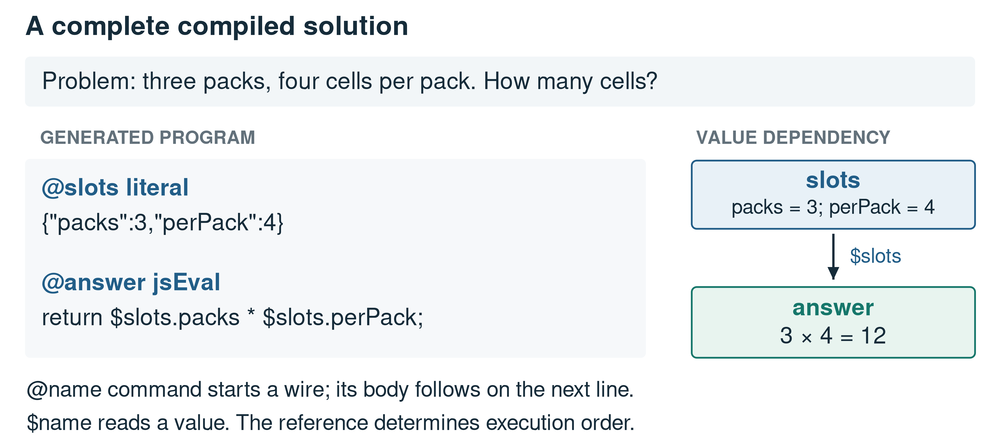
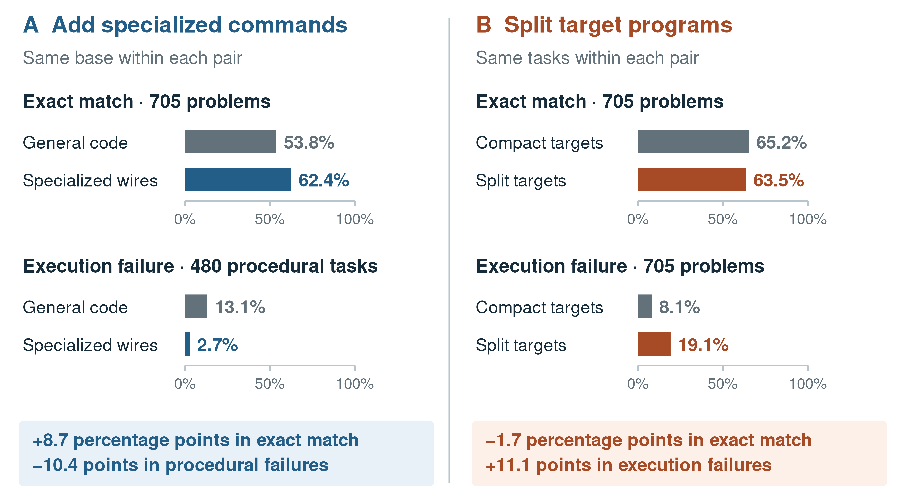
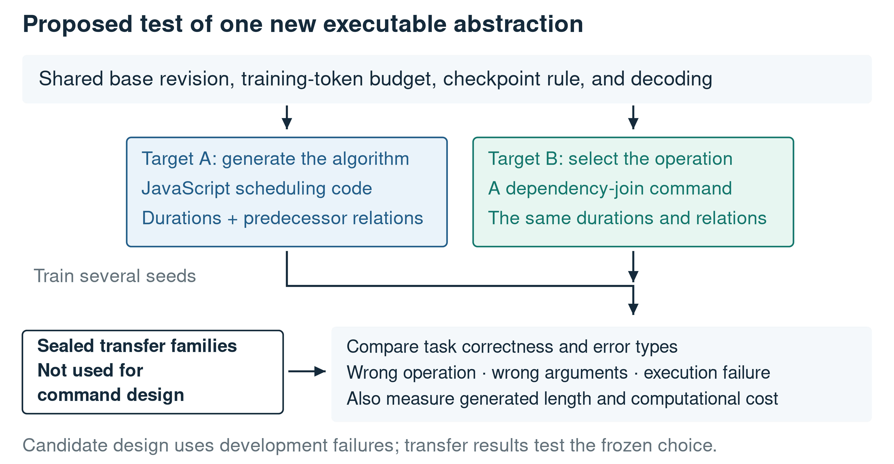

# Choosing the language a small model must learn: executable abstractions in program compilation

## Abstract

A small language model can delegate arithmetic to a runtime yet still fail to generate the required algorithm. We ask whether changing its target language can reduce that difficulty. SOP Lang is the executable representation studied here: a program contains named computations, called wires, whose explicit dependencies determine execution order. We reconstruct three representation/model comparisons and separately reassess archived base-model evaluations. Experiment A adds graph, aggregation, and fraction commands to a general-code curriculum. Normalized exact matches increase from 53.8% to 62.4%, while procedural execution failures fall from 13.1% to 2.7%. Experiment B instead divides target computations into more wires. Matches decrease from 65.2% to 63.5% and execution failures rise from 8.1% to 19.1%. Experiment C compares two adapted models on the same later evaluation set; it establishes a system difference, not a model-size threshold. Our interpretation is that useful abstraction removes algorithm construction from the generated program, whereas decomposition can add coordination work without removing it. One run per condition, incomplete early metadata, and repeated benchmark use limit causal inference. The results motivate searching for commands that reduce implementation errors while keeping task interpretation, argument extraction, and command selection measurable.

Keywords: small language models; program synthesis; executable abstractions; target representation; compositional generalization; reproducibility

## 1. Introduction

A model that knows it must find a path through a graph may still produce a faulty graph-search implementation. If the runtime already supplies a graph-search command, the model can express the same intention by selecting the command and identifying its inputs. This changes what the model must learn. It also leaves an important source of error untouched: choosing graph search for a problem that requires a different operation.

Program-aided language models make this division of work possible. Gao and colleagues' PAL generates programs and delegates their execution to an interpreter [@pal]. Chen and colleagues' Program of Thoughts separates numerical computation from language-model reasoning [@pot]. Once computation is delegated, the target language becomes an experimental choice. A model can generate a general-purpose algorithm, a composition of small operations, or a call to a more abstract operation. These representations need not be equally learnable by a small model.

We investigate that choice using SOP Lang, a language developed for this project. SOP Lang represents a solution as named computations with explicit value dependencies. The model writes the program, and a runtime executes it. We fine-tune small code-capable models to translate word problems into this representation, then inspect the saved programs and their outcomes.

The research question is whether an executable vocabulary can reduce the implementation burden on a small model without merely relocating failure to command selection. It matters because improving the interface between model and runtime may recover useful capability without changing the base model. A vocabulary that is too detailed, too broad, or poorly matched to the tasks may do the opposite.

We organize the evidence around three comparisons. Experiment A introduces specialized commands. Experiment B increases the number of wires in training targets. Experiment C changes the base model on an otherwise shared evaluation set. The strongest result is the contrast between A and B: adding an operation that owns an algorithm helps, while splitting an algorithm across more generated components can hurt. We interpret this contrast as evidence that abstraction level, rather than component count alone, deserves explicit study.

## 2. SOP Lang and the learning problem

### 2.1 Reading a circuit

A SOP Lang program is called a circuit. Its basic unit, a wire, is a named computation that produces a value; it is not a physical connection. A declaration has the form `@name command` at the start of a line. The text until the next declaration is that command's body. A reference such as `$slots` reads another wire's value and declares a dependency. The runtime determines execution order from these dependencies, not from the order of declarations.

Consider the problem, "There are three packs, each containing four cells. How many cells are there?" A compiled solution is:

```sop
@slots literal
{"packs":3,"perPack":4}

@answer jsEval
return $slots.packs * $slots.perPack;
```

The first wire is named `slots`. Its `literal` command reads a JSON body and produces the object containing 3 and 4. The second wire is named `answer`. Its `jsEval` command evaluates a JavaScript body, where `return` supplies the wire's value. The expression `$slots.packs` reads the `packs` field of the first wire. Thus `answer` depends on `slots` and returns 12. The caller requests the `answer` value; that name is a dataset convention, not a special language keyword. Likewise, `slots` is a conventional name for values extracted from the problem.

Figure 1 connects this notation to the resulting dependency graph. The graph explains evaluation order, but it cannot certify that multiplication expresses the question. If one cell in each pack were unusable, the same program would execute successfully and answer the wrong task.



Figure 1. A complete SOP Lang example. The model supplies the extracted values and operation; the runtime evaluates the declared dependency. This constructed example illustrates the language and is not a benchmark observation.

### 2.2 Abstraction changes the generated work

General JavaScript lets the model express many algorithms, but requires it to emit their implementation correctly. A specialized command moves one algorithm into the runtime. For example, `graphPath` accepts an undirected edge list and two endpoints, then performs reachability internally. The model still has to extract the graph and select the right endpoints. It no longer has to generate a queue, a visited set, and traversal termination logic.

The other commands introduced in Experiment A are `aggregate`, for supported filtering and reduction operations, and `fraction`, for reducing an integer ratio. Each has a restricted input/output contract. A command for undirected reachability cannot answer a directed shortest-path question simply because both involve graphs. A shorter generated program is useful only when the selected command preserves the problem's meaning.

This differs from decomposition. Splitting a JavaScript computation into several wires may leave the same algorithmic decisions in the model's output while adding names and value transfers. The model must now coordinate more interfaces. Our working explanation is that abstraction can remove generated implementation work, whereas decomposition may only distribute that work. Experiments A and B test these two development choices in the available archive.

### 2.3 Relation to prior work

Gulwani, Polozov, and Singh identify specification and program search space as central dimensions of program synthesis [@synthesis]. Here, the natural-language problem and reference answer specify the task imperfectly, while the command vocabulary constrains the program space. The runtime can enforce its command semantics without establishing that the model interpreted the specification correctly.

DreamCoder, by Ellis and colleagues, learns reusable program libraries and uses them in subsequent synthesis [@dreamcoder]. Our commands were introduced through human-directed development assisted by coding agents. We do not implement DreamCoder's automatic library-learning procedure. Its relevance is the idea that changing available abstractions can change synthesis difficulty. Finding new SOP Lang commands automatically remains an open research question.

Lake and Baroni's compositional-generalization work motivates distinguishing new numerical instances from new computational structures [@scan]. This distinction is essential here because many evaluated problems share the same generator and plan. A model can learn a circuit form reliably while failing to select that form for an unfamiliar kind of problem.

## 3. Study design

### 3.1 Experiments and observations

This is a retrospective analysis of a developmental experiment archive. We reconstruct ten saved runs, each containing 705 unique evaluation items, and select the three comparisons relevant to the representation question. A run is one trained system under one condition; an experiment below compares two such systems. The supplementary experiment map connects these descriptive names to original manifests, checkpoints, dataset versions, and source hashes.

Table 1 defines the interventions before reporting their outcomes. Each of these comparisons contains 705 problems per condition and retains the same evaluation identifiers and reference-answer strings within that pair. This does not establish identical historical prompt bytes, which were not fully retained. Experiments A, B, and C also do not share an unchanged evaluation population across the entire development history.

Table 1. The three comparisons and the inference each permits.

| Experiment | Conditions compared | Base model | Main question |
| --- | --- | --- | --- |
| A: command abstraction | General code; specialized wires | Qwen2.5-Coder-1.5B-Instruct in both | Does a narrower executable vocabulary help compilation? |
| B: target decomposition | Compact targets; split targets | Qwen3-1.7B in both | Does distributing computation across more wires help? |
| C: base-model choice | 0.5B model; 1.7B model | Qwen2.5-Coder-0.5B-Instruct; Qwen3-1.7B | How do these two trained systems differ on the same later tasks? |

The model names follow the official release identities [@qwen15] [@qwen05] [@qwen3]. Experiment C changes model family and pretraining together with size. It cannot isolate the effect of parameter count.

### 3.2 Training data and evaluation tasks

Training examples are constructed from parameterized problem families derived from source books and procedural generators. A family provides a reference parse, an answer computation, and a target circuit. Candidate circuits are executed against expected answers. Structural checks and selected assertions reject malformed examples, while perturbing extracted inputs helps detect answers that ignore those inputs.

These controls address concrete defects in synthetic data. They do not prove semantic correctness when the generator, reference computation, and circuit share the same mistaken reading. Some categorical answers also remain unchanged under legitimate input changes. We therefore describe the data as checked, with retained provenance, rather than independently verified in every semantic respect.

Each evaluation set contains 480 procedural problems and 225 book-derived problems. The set used in Experiment B has 28 distinct plan fingerprints, a structural index of computations: 12 procedural plans and 16 book-derived plans. Its 20 coalition problems share one plan, and its 100 dependency-join problems share another. A dependency join asks when parallel branches can finish and whether the resulting schedule meets a time limit. These repeated instances are useful execution tests, but do not supply 705 independent tests of general reasoning.

Development repeatedly used the nominal holdout to guide changes. We consequently call it a development benchmark. Dwork and colleagues explain why adaptive test reuse weakens independent confirmation [@dwork]. Between the versions used in B and C, 7.1% of evaluation identifiers are replaced and 15.3% of the 655 retained identifiers have changed reference strings. We compare conditions within each experiment, not scores across these changing populations.

### 3.3 Training and decoding

Later runs use full fine-tuning with AdamW, learning rate 0.0001, two epochs, seed 3407, effective batch size 32, maximum sequence length 4,096, and bfloat16 precision. Checkpoints are selected using the archived validation procedure. Evaluation uses the selected GGUF export, greedy generation, a 2,048-token output limit, and one task attempt. Transport recovery is not a second attempt to solve the problem.

One run per condition survives in the archive. The general-code condition in Experiment A lacks its complete training manifest, so training equivalence cannot be fully reconstructed. Even in B, shared settings do not imply identical exposure: split targets contain 2.0% more target tokens than compact targets, approximately 6.78 million versus 6.65 million. We reconstruct saved outputs without retraining or generating new answers.

### 3.4 Outcome definitions

The evaluator checks parsing, dependency-graph validity, execution, and the returned answer separately. A normalized exact match means the answer equals the reference after Unicode, case, whitespace, and specified punctuation/prefix normalization. It is not a general semantic judgment. A completed mismatch is an executed answer that fails that comparison; an execution failure produces no accepted task answer.

We recount all 7,050 records, reproduce the original comparator labels, and join paired runs by item identifier. Counts and paired differences describe the archive. Percentages and percentage-point differences are rounded separately from integer counts. We do not attach inferential confidence intervals to repeated templates with one training run per condition. The complete ten-run reconstruction is available in the supplement, including development variants outside these three comparisons. A separate early reference comparison joins two untuned base evaluations to their corresponding fine-tuned systems on 585 shared identifiers and unchanged reference answers. Here "base" means the released instruction-tuned checkpoint before SOP Lang adaptation, not a model without prior training.

## 4. Results and interpretation

### 4.1 Reference comparison: before and after SOP Lang adaptation

The early archive permits a direct comparison of two released Qwen2.5-Coder models with their adapted counterparts on the same 585 problem identifiers and reference answers. The base models answer in prose; the adapted models emit programs whose executed answers are scored. To avoid silently comparing different scoring rules, we apply both historical reference-content matching and normalized exact matching to both sides.

The content check accepts the presence of every reference number, or normalized containment of a non-numeric reference. It is a weak diagnostic: it can ignore units, role assignments, and contradictory prose. Exact matching has the opposite problem of rejecting equivalent wording. Table 2 reports the two measures separately rather than naming either one general semantic accuracy.

Table 2. Base checkpoints versus their SOP Lang adaptations. All entries are percentages over the same 585 problems per row; each scorer is applied identically to base and adapted outputs. The content check is the historical weak diagnostic described above.

| Base model | Base content match | Adapted content match | Base exact match | Adapted exact match |
| --- | --- | --- | --- | --- |
| Qwen2.5-Coder-0.5B | 10.8% | 44.4% | 0.0% | 44.1% |
| Qwen2.5-Coder-1.5B | 5.1% | 61.4% | 0.2% | 55.0% |

The adapted workflow recovers reference content much more often for both bases. The larger model is stronger after adaptation under both checks, although it is weaker as a direct-answer base under this prompt and diagnostic. This reversal shows why parameter count alone is an inadequate explanation of these observations. We interpret the result as support for the complete trained-compilation workflow on these tasks. It does not isolate execution from fine-tuning or prompting, and generation budgets differ: the retained prose evaluator uses a 512-token cap, whereas compiled evaluation allows 2,048.

An additional Qwen3 base evaluation returns no completion on 45.7% of its 705 requests. We retain that record in the supplement but exclude it from this cleanly joined base-model table. Treating missing responses as evidence of a model-capacity limit would confound serving behavior with task solving.

### 4.2 Experiment A: specialized commands improve the recorded system

Adding graph, aggregation, and fraction commands increases normalized exact matches from 53.8% to 62.4%, an improvement of 8.7 percentage points. On paired items, the specialized condition gains a match on 8.9% of problems and loses one on 0.3%. Reference-plan fingerprints change on 5.7% of problems; item identifiers and expected answer strings remain unchanged.

The procedural subset accounts for the improvement. Its matches rise from 78.5% to 91.7%, and execution failures fall from 13.1% to 2.7%. Our interpretation is that moving recurring algorithms into tested operations makes the target easier for the student to generate reliably. This is the clearest positive evidence for the vocabulary hypothesis in the archive.

There is a useful complication. Only 8.3% of procedural outputs in the specialized condition declare one of the three added commands, while the procedural match rate improves by 13.1 percentage points. Direct command execution therefore cannot explain the entire gain. Changed training representations may also improve programs that still use JavaScript, and uncontrolled early training differences remain possible. A future ablation must separate command availability, target rewriting, and direct command use.

Table 3 retains all outcome classes for the three experiments. Figure 2 makes the opposite effects of abstraction and decomposition visible.

Table 3. Outcome percentages within each experiment. Every condition has 705 evaluated problems. Completed mismatches are distinct from execution failures.

| Experiment | Condition | Match | Completed mismatch | Execution failure |
| --- | --- | --- | --- | --- |
| A | General code | 53.8% | 17.7% | 28.5% |
| A | Specialized wires | 62.4% | 12.8% | 24.8% |
| B | Compact targets | 65.2% | 26.7% | 8.1% |
| B | Split targets | 63.5% | 17.3% | 19.1% |
| C | 0.5B model | 51.2% | 18.4% | 30.4% |
| C | 1.7B model | 59.7% | 14.2% | 26.1% |



Figure 2. Two representation changes have opposite observed effects. Experiment A reduces procedural execution failures from 13.1% to 2.7%. Experiment B raises overall execution failures from 8.1% to 19.1%. The failure panels have different, explicitly stated populations.

### 4.3 Experiment B: more components can make generation harder

Splitting target computations into more wires lowers matches from 65.2% to 63.5% and raises execution failures from 8.1% to 19.1%. The split condition loses matches on 2.0% of paired problems and gains them on 0.3%. Both conditions achieve 100% syntax and graph acceptance.

The practical conclusion is that valid decomposition is not necessarily learnable decomposition. A student may emit legal references and an acyclic graph yet misuse an intermediate value or generate faulty code inside a component. Our proposed explanation is an increased coordination burden: more interfaces must be generated consistently, even when individual bodies become shorter. The aggregate error increase is consistent with that explanation, but we have not classified every failure by a causal mechanism.

This result changes the design recommendation. A new wire should remove a recurring algorithmic obligation, or make a necessary distinction easier to express. Increasing the number of intermediate wires is not itself evidence of progress. A controlled follow-up should measure dependency-binding errors and generated length alongside task correctness.

### 4.4 Experiment C: base-model choice matters, but does not define a size floor

On the same later evaluation identifiers, reference strings, and plan fingerprints, the 0.5B system matches 51.2% of problems and the 1.7B system matches 59.7%. The advantage is 8.5 percentage points. In the paired comparison, 8.7% of cases match only for the 1.7B system and 0.1% only for the 0.5B system.

For a practitioner choosing between these two trained systems, the 1.7B result is better under the recorded evaluation. For a theory of small-model capacity, the comparison is insufficient. Both family and pretraining change with size, and each condition has one run. The result does not locate a universal minimum model size for reasoning. It reinforces the need to measure the combined model, vocabulary, curriculum, and executor.

### 4.5 What the aggregate scores conceal

All ten reconstructed runs pass syntax and graph checks on 100.0% of items, while answer and execution outcomes differ substantially. In B's compact condition, procedural matches are 91.3%, but book-derived matches are only 9.8%. The coalition family contributes most of those book-derived matches. The model has learned the outer language more reliably than it transfers across the tested task structures.

Some completed mismatches also arise from answer form. A retrospective parser for B's 100 dependency-join outputs accepts complete duration-and-feasibility sentences under a declared grammar. Its outcome rates are 64% matched, 26% unclassified, 2% disagreeing, and 8% execution failure; normalized exact matching accepts 0%. On C's 20 coalition outputs, a tuple-set parser accepts 100.0% for the 1.7B condition against 25.0% original matches. Both diagnostics are deliberately narrow and preserve per-item decisions. They do not define a new overall semantic score.

## 5. What we think happened

The evidence supports a specific account of the opportunity. The small model often learns how a circuit is written before it can reliably implement every computation inside that circuit. Commands that own a useful algorithm can reduce that second burden. Experiment A provides a substantial positive signal; Experiment B shows why that signal should not be generalized to every form of additional structure.

The remaining difficulty is interpretation. A graph command cannot correct missing edges, reversed relations, or the selection of reachability when the problem asks for a shortest route. More abstract operations may therefore move failure from algorithm construction toward extraction and command selection. That shift can still be valuable, provided it is measured rather than hidden in a single accuracy total.

Coding agents assisted the data pipeline, implementation, experiment tooling, analysis, and manuscript preparation. This made executable reconstruction possible but also creates a risk that the same assumption appears in code, tests, and explanation. Sandve and colleagues' reproducibility practices support preserving those transformations [@sandve]. Independence still requires evidence that can challenge the shared assumption. The present audit is not external peer review or independent human relabeling.

The main limits are one run per condition, incomplete early training metadata, repeated benchmark inspection, synthetic and structurally concentrated tasks, and no equal-budget ablation isolating execution from adaptation and prompting. No energy saving, general model-capacity law, or state-of-the-art advantage is measured. These limits narrow the explanation without erasing the observed improvement.

## 6. The next experiment: discovering useful wires

The next research step is to search for operations that replace repeated implementation failures. A dependency-join scheduler could own critical-path calculation. A units-and-rates operation could enforce dimensional compatibility. A solver interface could delegate a stated constraint problem to an established system such as Z3 [@z3]. These are candidate designs, not results from the present study.

Figure 3 proposes the comparison needed to evaluate such candidates. Development traces supply the failure cases and command design. A separately frozen transfer set remains outside that loop. For each candidate, equivalent tasks are rendered as general-code and specialized-command targets using the same base revision, training-token budget, checkpoint rule, and decoding budget. Several seeds are needed to estimate run variability.



Figure 3. Proposed test of a new abstraction. The two target representations differ while training and evaluation rules are held fixed. This confirmatory design was not performed in the archived study.

A wire should be retained when it improves task outcomes without an offsetting rise in wrong-command or wrong-argument errors on other families. Direct command use, execution failures, generated length, and measured computational cost should be reported. Negative candidates belong in the record. The objective is a vocabulary whose operations are both useful and reliably selectable, not the largest possible catalogue.

## 7. Conclusion

The target language is part of the learning problem. In Experiment A, specialized commands raise normalized exact matching from 53.8% to 62.4% and lower procedural execution failures from 13.1% to 2.7%. In Experiment B, additional decomposition raises execution failures from 8.1% to 19.1%. We interpret the difference as evidence that removing algorithm construction can help a small model, while adding interfaces can make its job harder.

Useful abstraction does not remove the need to understand the task. The next scientific question is which new commands reduce implementation difficulty while preserving reliable selection and transfer. The current results justify that search and specify the controls needed to test it.

## Data, code, and disclosure

Online Resource 1 contains the experiment-to-archive map, complete ten-run outcomes, exact model identities and training timestamps, source hashes, paired comparisons including the base-model reanalysis, diagnostic decisions, and reconstruction scripts. No training or model inference was repeated for this analysis. Public deposit details, authorship, funding, and competing-interest declarations require completion before submission. Coding-agent assistance is described in Section 5.

<!-- REFERENCES -->
