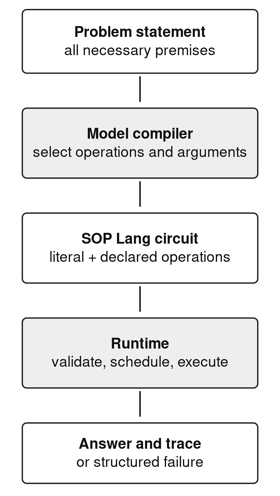
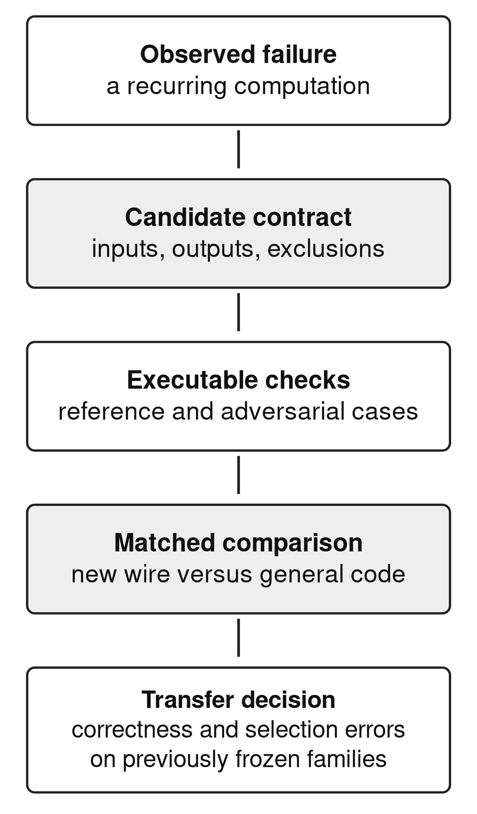

# SOP Lang: Contract-Bearing Wires for Small-Model Program Compilation

## Abstract

A language model that emits executable code can delegate computation while still generating faulty algorithms or selecting an unsuitable operation. This technical article presents SOP Lang, a dependency-oriented language for exposing a small, inspectable command vocabulary to a fine-tuned model. A circuit consists of named wires with declared dependencies, versioned command contracts, bounded execution, and recorded outcomes. General JavaScript wires coexist with specialized graph, aggregation, and fraction commands. We explain the compilation and execution boundary, provide an executable graph example, and describe how training circuits are checked against reference answers and perturbed inputs. An artifact-based evaluation reconstructs ten archived arms with 705 items each. The early vocabulary transition increases normalized exact matches from 379/705 to 440/705, while procedural execution failures decline from 63/480 to 13/480. A later target-decomposition change instead increases execution failures from 57/705 to 135/705. All reported arms pass syntax and graph checks on every item, demonstrating that structural acceptance is insufficient for task correctness. The evidence motivates a contract-first process for adding wires, but does not establish automatic abstraction discovery or formal verification. We identify current implementation boundaries, limitations of agent-assisted oracle construction, and an evaluation protocol for future command extensions.

Keywords: domain-specific languages; small language models; program synthesis; runtime contracts; executable evaluation

## 1. Introduction

Generating a program is one way to move calculation out of language-model token generation. PAL and Program of Thoughts demonstrate this division of work for language-model problem solving [@pal] [@pot]. Once execution is delegated, a systems question remains: which operations should the generated program expose directly, and which should a tested runtime own?

SOP Lang addresses this question through named wires. A wire is a computational node with a command, a body, and dependencies on other wires. The model selects commands and supplies task-specific data; the runtime determines evaluation order and applies command contracts. General-purpose JavaScript remains available, but recurring operations can move into narrower commands. The design seeks to reduce the amount of low-level algorithmic code a small model must generate while preserving an explicit record of what it asked the system to do.

The distinction between a valid circuit and a correct answer is fundamental. A dependency graph can be acyclic, all values can satisfy their schemas, and the final answer can still solve the wrong problem. SOP Lang exposes the intermediate program to make that mistake inspectable. It does not convert runtime acceptance into evidence of correct natural-language interpretation.

The research question is which parts of a small model's generated computation can usefully move into contract-bearing commands, and which obligations remain with the model. This matters to engineers choosing between unrestricted code generation and a growing catalogue of tools: either choice can create errors that a parser alone will not detect. We answer through the implemented command interface, an executable example, and a retrospective evaluation of successful and unsuccessful representation changes. The implementation includes capabilities broader than those exercised in the word-problem evaluation; those boundaries are stated where they affect the evidence.

## 2. Design context

Program-synthesis systems depend on a representation of candidate programs, a specification, and a search procedure [@synthesis]. Here, the student language model supplies the search procedure, SOP Lang supplies the representation, and the problem statement plus oracle supplies the task specification. The design deliberately gives the runtime authority over dependency scheduling, allowed effects, and bounded execution. Interpretation remains a learned behavior.

LLMCompiler demonstrates a related separation of planning and execution for parallel function calling [@llmcompiler]. SOP Lang's focus is different: it trains a small student to emit a circuit under a compact language contract and evaluates the resulting executable answers. We do not claim a scheduling-speed advantage over LLMCompiler, because no matched performance experiment was performed.

DreamCoder provides a precedent for learning reusable abstractions as part of synthesis [@dreamcoder]. The present vocabulary was developed through human-directed, coding-agent-assisted revisions. Automatic command discovery is an intended extension. The existing results support investigating that extension, rather than describing it as completed functionality.

## 3. Language and execution model

### 3.1 Wires, values, and dependencies

An SOP Lang declaration begins with a wire name and command. References beginning with a dollar sign identify values read from other wires. A circuit's requested output is usually an `answer` wire, although callers can select other outputs. Dependencies are extracted from the command body according to the command's declared body format. The runtime builds and checks the active graph before evaluating ready nodes.

Table 1 summarizes the standard operations most relevant to the experiments. A command manifest documents the command name and version, syntax, intended use, excluded cases, inputs, outputs, determinism, and permitted effects. These fields help both the compiler model and the executor identify the same operation. Natural-language descriptions do not replace executable checks.

Table 1. Selected implemented commands and their boundaries.

| Command | Operation and important restriction |
| --- | --- |
| literal | Stores task data explicitly in the circuit. Correct extraction remains the model's responsibility. |
| jsEval | Runs generated JavaScript with copied dependency values in a bounded guest realm. |
| graphPath | Answers undirected reachability or counts incident edges. It is not a weighted or directed path solver. |
| aggregate | Filters by a supported comparison or divisibility predicate, then computes sum, count, minimum, maximum, or mean. |
| fraction | Returns a reduced ratio from integer counts or a supported divisibility query. |
| modelCall | Makes a declared neural call under a request budget; its result is not deterministic by contract. |
| container family | Declares stores and stages explicit patches or filtered views under revision rules. |

The limitations in Table 1 are computationally significant. For example, `graphPath` rejects identical start and target nodes rather than defining reflexive reachability, and rejects nodes absent from the stated edge list. Its count mode counts incident edge entries; repeated edges are not silently deduplicated. A model that applies conventional graph assumptions without reading this contract can produce an accepted command selection with an unexpected outcome.

Similarly, aggregation over an empty selected list returns zero for sum and count, while minimum, maximum, and mean reject the empty list. A fraction wire requires a positive integer total and a non-negative integer favorable count no larger than the total. These restrictions make behavior explicit and testable. They do not imply that every task should be forced into the available operations.

### 3.2 A complete graph example

Consider the illustrative problem: “The undirected links are A–B and B–C. Is C reachable from A?” The circuit below states the extracted edges and delegates traversal to `graphPath`. Its final result is the string `yes`. The example is a demonstration of the current runtime, not an additional benchmark observation.

```sop
@slots literal
{"edges":[["A","B"],["B","C"]],
 "start":"A","target":"C"}

@answer graphPath
edges: $slots.edges
from: $slots.start
to: $slots.target
```

The model does not generate breadth-first-search control flow. It must still extract both edges, preserve the node identities, choose an undirected command, and bind the correct endpoints. If the original statement said the links were directed, this same command would express a different problem. That error cannot be detected by checking the internal consistency of the circuit alone.

The example also makes a useful extension test. Replacing the second edge with C–D should return `no`, because the target remains present but disconnected. Replacing the target with absent node E should produce a structured failure. These checks probe distinct parts of the contract: traversal behavior and validation of the declared graph domain.

### 3.3 Scheduling, effects, and failure

The runtime parses declarations, resolves the command registry, analyzes dependencies, and computes a deterministic topological schedule for the active graph. Values cross boundaries by copy; mutating a JavaScript dependency does not mutate a caller value or a sibling wire's observation. General JavaScript runs in an isolated guest realm within a worker, with execution time and resource limits. This article does not present a security audit of that isolation mechanism.

State-changing operations use explicit staging and revision rules. Container patches and graph transactions commit at epoch barriers; affected observations become invalid and are recomputed. A final requested answer is published only after its dependencies are valid in a stable revision. The implemented runtime also records command identities, definition hashes, observed dependencies, outputs, and failures. These records support inspection and replay checks.

Figure 1 shows how these responsibilities connect the problem statement to an executable answer.



Figure 1. The implemented compilation boundary. The model owns task interpretation; the executor owns the behavior of the selected circuit.

A run can complete, fail, or stop with a partial result when a budget or unresolved dependency prevents completion. Errors carry structured codes rather than substitute answers. Replay of a recorded neural observation requires matching definitions and dependency hashes. Fresh neural generation remains distinct from replay and is not promised to be bit-for-bit reproducible.

The word-problem experiment uses a narrower part of this system. Its target circuits ordinarily embed problem values in literal wires and compute answers without an external model binding. Runtime support for containers, graph mutation, and compiled-context machinery must not be interpreted as evidence that the evaluated student has learned all those capabilities. The long-document compilation vision extends beyond the results reported here.

## 4. Constructing and checking teaching circuits

The teaching pipeline starts with parameterized problem families. A family records the task structure, a reference parse, an answer computation, a circuit constructor, and explanatory material. Book-derived source material provides problem forms; procedural families expand the range of executable compositions. Dataset exports preserve model-facing statements and target circuits, together with provenance and split information.

Candidate circuits are executed against the stated answers. Probe assertions express selected input and output conditions. Dataset verification also perturbs literal values and checks whether the output changes when relevant values change. A hard-coded answer that ignores all inputs is therefore detectable in circumstances where the perturbation should affect the answer. A stable categorical verdict requires more care: unchanged output under the available perturbations may be uninformative rather than proof of hard-coding.

These checks are useful engineering controls, but their independence is limited. The source parser, reference computation, and circuit generator may encode the same mistaken interpretation. Agreement between them does not establish agreement with the source's intended meaning. The research used coding agents in implementation and analysis, making correlated mistakes across code and prose a practical concern. The appropriate claim is checked teaching data with retained provenance, not formally verified semantic truth.

The same discipline applies to a proposed new wire. A family round trip should test both successful examples and cases outside the command contract. A new command must not silently alter old semantics to accommodate a model's output. Its version, tests, documentation, and data-export identity should change together. This makes a regression attributable to a concrete language or curriculum revision.

## 5. Artifact-based evaluation

### 5.1 Method

The analysis reconstructs ten archived arms from 7,050 item records, with 705 unique identifiers per arm. The evaluation slice comprises 480 procedural problems and 225 book-derived problems. In the dv7 slice these represent 28 distinct plan fingerprints, with several book subsets containing one repeated plan. Repeated instances provide useful execution checks, but do not constitute hundreds of independent tests of general reasoning.

The early exp-014/exp-016 pair uses Qwen2.5-Coder-1.5B-Instruct before and after the introduction of specialized wires [@qwen15]. Later arms use Qwen3-1.7B, except one Qwen2.5-Coder-0.5B-Instruct arm [@qwen3] [@qwen05]. Archived base manifests identify the exact revisions.

Later training uses seed 3407, two epochs, AdamW at learning rate 0.0001, effective batch size 32, maximum sequence length 4,096, and bfloat16 precision. Selected checkpoints are evaluated with greedy decoding and a 2,048-token output cap. Saved item outcomes, rather than freshly generated outputs, are the observations in this study. A missing exp-014 training manifest limits control claims for the early pair.

The evaluator distinguishes structural rejection, execution failure, completed mismatch, and normalized exact answer match. Normalization folds case, whitespace, and selected punctuation; it is not a semantic comparator. We reapply the original comparator to every completed record and reproduce all stored match labels. The benchmark was repeatedly inspected during development, so its traditional “holdout” label does not mean a sealed external test.

### 5.2 Vocabulary and decomposition results

Table 2 presents the system comparisons most relevant to command design. Both early arms have identical evaluation identifiers and oracle strings. The specialized-wire arm gains 63 newly matched cases and loses two previously matched cases, for a net gain of 61/705. On the procedural subset, execution failures fall by 50, from 63/480 to 13/480. This is substantial descriptive evidence that the target vocabulary can matter.

Table 2. Selected archived systems. Match and execution-error counts each use 705 evaluated items.

| System and data | Match | Execution errors |
| --- | --- | --- |
| Qwen2.5-Coder-1.5B, dv2 | 379 | 201 |
| Qwen2.5-Coder-1.5B, dv3 wires | 440 | 175 |
| Qwen3-1.7B, dv7 | 460 | 57 |
| Qwen3-1.7B, dv8 split targets | 448 | 135 |
| Qwen2.5-Coder-0.5B, dv13 | 361 | 214 |
| Qwen3-1.7B, dv13 | 421 | 184 |

The result is not a demonstration that every gain requires executing a new command. Forty procedural outputs in the revised early arm use `graphPath`, `aggregate`, or `fraction`, while the procedural match gain is 63. A representation change can alter learning beyond its direct command calls, and other uncontrolled training differences remain possible. Establishing the mechanism requires a purpose-built ablation.

The later dv7-to-dv8 comparison supplies a counterexample to a different design heuristic. Explicitly splitting targets into more wires reduces total matches from 460/705 to 448/705 and increases execution errors from 57/705 to 135/705 on unchanged identifiers and oracle strings. Both arms pass syntax and graph validation on all 705 cases. Shorter local computations can therefore coexist with worse executable coordination.

Other later curriculum variants also fail to exceed dv7 on the original comparator: dv9 matches 428/705, dv11 matches 439/705, and dv12 matches 432/705. The dv13 scores must be interpreted separately because 50 identifiers are replaced and 100 oracle strings change relative to dv7. The common denominator conceals a changed test population.

### 5.3 What the outcome ladder reveals

All ten selected arms pass syntax and graph checks on 705/705 items. This establishes learned structural regularity under the evaluator, while the remaining errors show its limits. In exp-021, 648/705 programs complete, but only 460/705 pass normalized exact comparison. A systems report should preserve both numbers. “Valid program,” “completed program,” and “correct answer under this comparator” are distinct observations.

The 20 coalition cases illustrate how inspecting generated commands changes a causal story. Their exact matches rise from 0/20 in exp-017 to 20/20 in exp-021. The latter curriculum contains container-oriented examples, but none of those 20 evaluated completions declares a container-family command. The finding is a curriculum-associated improvement on one coalition plan, not evidence that executing container operations caused success across an entire book.

The smaller dv13 system matches 361/705 against 421/705 for the Qwen3 system. These systems differ in base family as well as marketed size. The difference is relevant for choosing between the archived implementations, but cannot establish a general minimum model size for circuit compilation.

### 5.4 Answer contracts are part of system design

Some completed mismatches arise from output representation. A restricted coalition parser, applied retrospectively, maps complete tuple lists to a canonical set of coalition/count pairs. It accepts 20/20 exp-027 outputs where normalized exact matching accepts 5/20. A separate parser for completion-time and feasibility sentences accepts 64/100 exp-021 dependency-join outputs where the original comparator accepts none. Its remaining cases comprise 26 outside its grammar, two parsed disagreements, and eight execution failures.

Table 3 states the property supported by each check, including the task-level review that the archive does not provide.

Table 3. Different checks answer different questions.

| Check | What acceptance supports |
| --- | --- |
| Parse and graph checks | The emitted circuit satisfies the evaluator's structural requirements. |
| Completed execution | The selected operations returned an answer under the runtime budget. |
| Normalized exact match | The returned text agrees after the documented normalization. |
| Restricted tuple/verdict check | The complete output has the same values within a declared grammar. |
| Independent task review | The specification and oracle represent the intended problem; not performed across this archive. |

These diagnostics motivate structured answer schemas designed with the task. They remain separate from the original benchmark score. A system whose evaluation contract changes after seeing its failures needs separate labels for original and retrospective results, including cases on which the new check abstains.

## 6. Extending the vocabulary

The empirical results suggest a practical admission rule for new commands. A candidate should replace a recurrent computation whose implementation errors are observable, have a compact contract, and retain enough information to reject inappropriate uses. “Makes the program shorter” is insufficient. The negative target-splitting result shows why local code size and end-to-end task reliability can move in opposite directions.

A proposed dependency-join wire could receive an explicit task graph and durations, detect cycles, compute a critical path, and return a structured time and feasibility value. It would remove queue and maximum-path code from the generated target. It would still require the model to identify which activities are parallel, which precede others, and whether waiting time belongs in the graph. These interpretation choices should appear as inspectable inputs rather than hidden conventions.

A units-and-rates wire would need explicit dimensional rules and error cases for incompatible quantities. A solver interface would require a stated logic and a representation of constraints. Z3 demonstrates a mature satisfiability-modulo-theories implementation [@z3], but adding a solver command would only shift the learned task to correct constraint formulation. None of these proposed commands was evaluated in the present study.

Each extension should be tested against an equivalent JavaScript target with the same training-token budget, base revision, checkpoint rule, and decoding configuration. Several seeds and transfer families excluded from command design are needed. The evaluation should record command selection, argument extraction, execution errors, task correctness, generated length, and measured cost separately. A wire can reduce algorithm-generation failures while increasing mistaken selection; the admission decision must account for both.

Figure 2 summarizes the proposed admission process and its transfer requirement.



Figure 2. Proposed admission process for future commands. The final transfer step addresses a limitation of the current development series.

## 7. Limitations and reproducibility

This is a retrospective developmental evaluation with one run per condition. The test distribution is synthetic, repeatedly inspected, and concentrated in a small number of plans. The early comparison lacks complete training metadata, and later curriculum revisions alter more than the language vocabulary. No contemporaneous direct-answer baseline, formal semantic proof, security certification, or multi-seed estimate is provided.

Executable analysis and retained provenance follow the reproducibility principles articulated by Sandve and colleagues [@sandve]. The companion artifact [@artifact] contains reconstruction scripts, source hashes, paired comparisons, and restricted parser decisions. It also includes the illustrative graph circuit and its focused execution checks. Reproducing archived outcome counts is different from reproducing neural training; this study performs the former.

Coding agents assisted implementation, experimental tooling, evidence analysis, and manuscript preparation. Their outputs were subject to executable checks and artifact review, but this does not establish independent agreement between generators, tests, and prose. Human authors remain responsible for release and interpretation. Author identities, affiliations, funding, and competing-interest declarations must be supplied before submission; no such facts are inferred from repository names.

## 8. Conclusion

SOP Lang makes the division between model interpretation and executable operations concrete. The archive shows a useful positive signal when recurring algorithms become specialized wires, and a negative signal when additional target decomposition increases coordination failures. Both findings support treating command vocabulary as an empirical design variable. The next technical problem is to discover and validate new wires while measuring their selection burden, rather than assuming that a larger catalogue or a valid graph guarantees better reasoning.

<!-- REFERENCES -->
