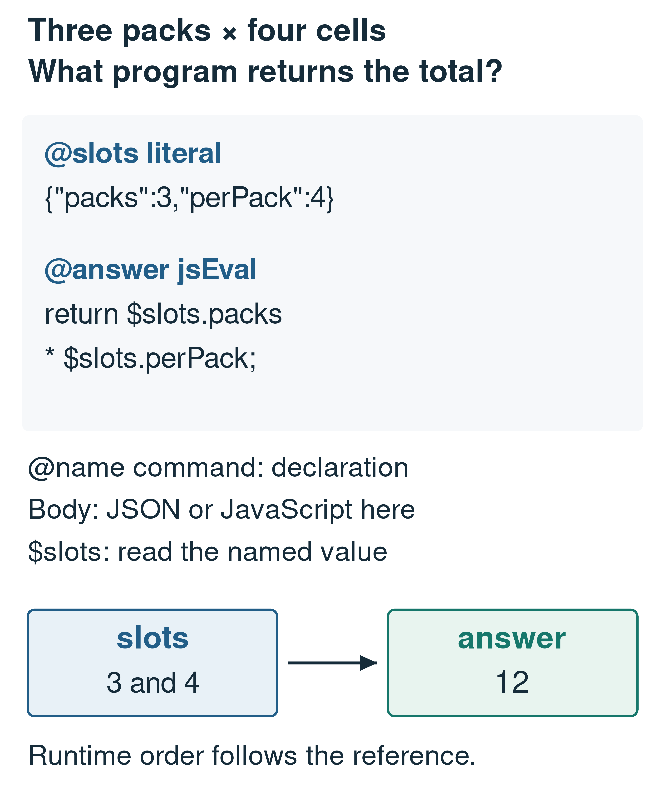
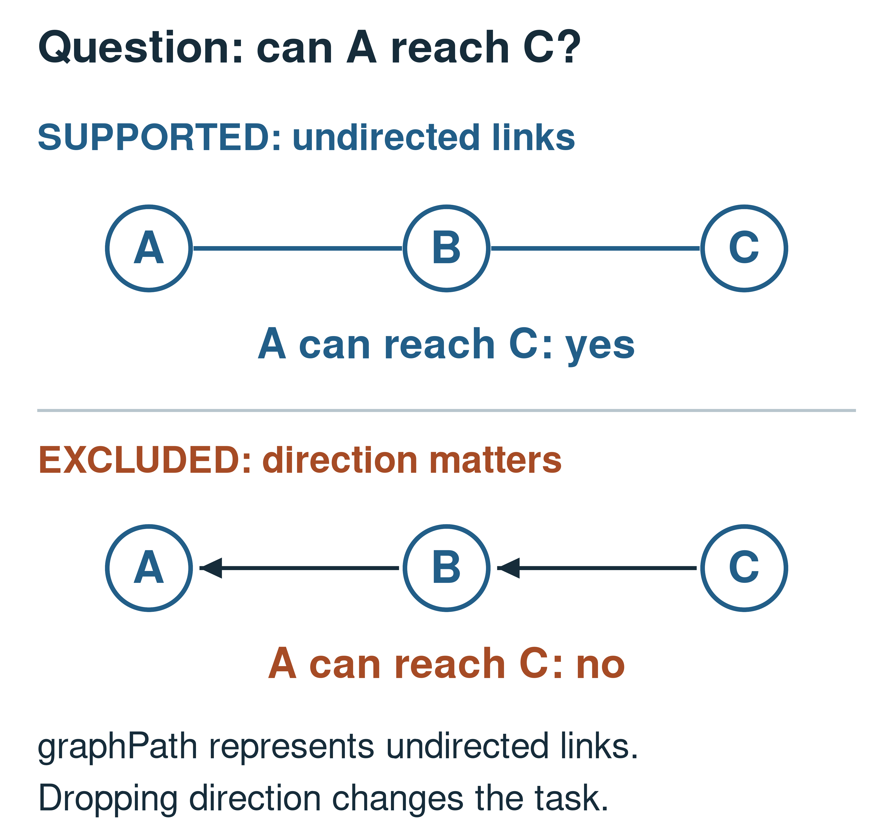

# SOP Lang: Moving Algorithms into Explicit Commands for Small-Model Compilation

## Abstract

A small language model can generate valid code while repeatedly failing to implement the algorithm a problem requires. This paper presents SOP Lang, an executable representation that lets a model select tested operations and supply their arguments. A program consists of named computations called wires; value references declare dependencies, and the runtime determines execution order. We introduce the declaration syntax, distinguish names from commands, and give complete arithmetic and graph examples. The technical question is which work should remain in the generated program and which work should move into a command implementation. Two archived comparisons address that question. Experiment A introduces graph, aggregation, and fraction commands, increasing normalized exact matching from 53.8% to 62.4% and reducing procedural execution failures from 13.1% to 2.7%. Experiment B splits computations across more wires; execution failures instead rise from 8.1% to 19.1%. These observations suggest that useful abstraction removes implementation work, whereas additional interfaces can make generation harder. The study uses one run per condition and a repeatedly inspected development benchmark, so it does not isolate a general causal effect. We derive a concrete admission procedure for new commands that tests semantic boundaries, selection errors, and transfer before extending the vocabulary.

Keywords: domain-specific languages; small language models; program synthesis; runtime contracts; executable evaluation

## 1. Introduction

An interpreter can calculate exactly what a generated program requests. It cannot repair an incorrect algorithm or decide that the model selected the wrong operation. This leaves a practical design question for systems that use a small language model as a program compiler: how much implementation detail should the model generate?

PAL and Program of Thoughts demonstrate the value of delegating calculation to executable programs [@pal] [@pot]. SOP Lang, introduced here, exposes a different part of that design space. It allows general JavaScript but also provides commands for selected recurring computations. The model can either generate an algorithm or name an operation already implemented by the runtime.

The research question is which computational obligations can usefully move into such commands, and which obligations remain with the model. This matters to an engineer deciding whether to add a tool, split a generated function, or enlarge the model. Those changes solve different problems. A graph traversal command removes traversal code; splitting that code into three components may merely add interfaces that can be misused.

We contribute a precise account of the implemented language boundary, examples that can be executed, and two developmental comparisons that test this distinction. The positive comparison supports specialized operations. The negative comparison shows that more explicit structure alone can make the system less reliable. Together they motivate measuring the work removed by a command, rather than treating vocabulary size or wire count as success criteria.

## 2. Reading and executing SOP Lang

### 2.1 Declarations, bodies, and references

A program is a circuit made of wires. A wire is a named computation with one resulting value. A line beginning in column one with `@name command` starts a declaration; its body continues until the next declaration. The command decides how to interpret the body. For example, `literal` reads JSON, `jsEval` evaluates JavaScript, and `graphPath` reads a small parameter configuration.

A value reference begins with a dollar sign. `$slots` means the value produced by the wire named `slots`; `$slots.packs` selects a field from that value. Reading a wire creates a dependency. The runtime checks the active dependency graph and schedules a computation after its dependencies are available. Textual declaration order is not execution order.

For "three packs with four cells per pack," the following complete circuit returns 12:

```sop
@slots literal
{"packs":3,"perPack":4}

@answer jsEval
return $slots.packs * $slots.perPack;
```

Here `slots` and `answer` are names chosen by the author of the circuit. `literal` and `jsEval` are registered commands. The first body's JSON supplies the problem values. The second body uses JavaScript's `return` to produce the answer. The caller requests the output named `answer`; neither `slots` nor `answer` is a reserved keyword. The training dataset uses these names as conventions.

Figure 1 annotates the syntax and its two-node dependency graph. A wire is the computation node, while a reference is the connection between nodes. This distinction avoids reading "wire" as a physical edge.



Figure 1. The core notation. Literal values and generated computation are explicit, and the requested output is a naming convention.

A declaration-like line that must occur literally inside a body can be escaped with a preceding backslash. Dependency analysis is command-specific: JavaScript references inside strings or comments are not dependencies. These rules keep the surface language small while allowing different body formats.

### 2.2 Replacing an algorithm with a command

Consider a second problem: "Undirected links connect A to B and B to C. Can A reach C?" The model can delegate traversal as follows:

```sop
@slots literal
{"edges":[["A","B"],["B","C"]],
 "start":"A","target":"C"}

@answer graphPath
edges: $slots.edges
from: $slots.start
to: $slots.target
```

The `graphPath` command parses the `edges`, `from`, and `to` parameters and returns `yes`. Its body is configuration, not JavaScript; it contains no `return` statement. The command constructs the adjacency representation and runs bounded traversal internally. Those implementation steps disappear from the model's output.

The model still owns the interpretation. It must extract both edges, preserve node identity, select undirected reachability, and bind the endpoints correctly. The example has been executed against the runtime. Replacing the second edge with C–D returns `no`; requesting an absent node returns a structured failure. These are checks of traversal and domain validation, respectively.

Figure 2 shows a boundary that matters before any code is run. Directed links B→A and C→B do not permit travel from A to C. Converting them to undirected links changes the task. An accepted `graphPath` request would then produce the wrong answer to the original question while correctly executing its own contract.



Figure 2. A command boundary is part of task meaning. The lower case is a constructed counterexample to using undirected reachability for a directed problem, not a measured model output.

### 2.3 What the command contract covers

Table 1 summarizes the operations that motivate the empirical comparison. These commands restrict the required arguments and the computation performed. They do not certify that the problem was mapped to the right arguments.

Table 1. Selected commands and their semantic boundaries.

| Command | Runtime-owned work and excluded cases |
| --- | --- |
| literal | Stores the JSON value supplied by the model; it does not validate extraction from prose. |
| jsEval | Executes generated JavaScript over copied dependency values under resource limits. |
| graphPath | Performs undirected reachability or incident-edge counting; it is not a directed or weighted path solver. |
| aggregate | Applies a supported comparison/divisibility filter and computes sum, count, minimum, maximum, or mean. |
| fraction | Reduces a supported integer ratio; arbitrary symbolic algebra is outside its contract. |

The restrictions are concrete. Reachability rejects identical start and target nodes and nodes absent from the edge list. Incident-edge counting counts entries rather than silently deduplicating repeated edges. Aggregation returns zero for an empty sum or count, but rejects an empty minimum, maximum, or mean. A fraction requires a positive integer total and a non-negative favorable count no greater than that total. A model must learn these meanings, not infer them from command names alone.

### 2.4 Scheduling and implementation boundary

The runtime parses declarations, resolves the command registry, extracts dependencies, validates the active graph, and executes ready wires. JavaScript receives copies of dependency values in a bounded guest realm. A failed command produces an error code and trace rather than an invented answer. These mechanisms provide inspectable execution; this paper does not claim a formal proof or security audit of the runtime.

The implementation also supports explicit neural calls, persistent containers, and staged graph/state changes. Such changes commit at revision boundaries so dependent computations can be invalidated and reevaluated. Those capabilities are broader than the measured word-problem task. The reported target circuits ordinarily embed extracted data in literals and perform deterministic computation without another model call. We do not infer that the student learned every runtime capability because the implementation provides it.

## 3. Design context and teaching data

Program synthesis depends on a specification, a space of candidate programs, and a search process [@synthesis]. SOP Lang defines a candidate language; the student model supplies the learned search behavior. A natural-language statement and expected answer provide the task specification, but they leave room for interpretation errors.

LLMCompiler separates planning, dispatch, and execution for parallel function calling [@llmcompiler]. The present contribution is narrower: a small student learns to emit a dependency-oriented representation with a deliberately chosen vocabulary. We report no scheduling-speed advantage over that work. DreamCoder provides a precedent for learning useful program abstractions [@dreamcoder], whereas the commands here were introduced through human-directed, coding-agent-assisted engineering. Automatic discovery remains proposed work.

The teaching pipeline builds parameterized problem families from procedural generators and source-book forms. A family produces a statement, reference computation, answer, and circuit. Candidate circuits are executed against the expected answers. Selected assertions check input and output properties, and perturbation checks test whether answers depend on the stated inputs. Model-facing examples preserve their source and split information.

These controls can detect malformed circuits, incorrect arithmetic, and some hard-coded answers. Their semantic independence is limited. If the family parser drops a condition, the reference computation and target circuit can agree on the same wrong problem. A stable categorical answer may also remain unchanged under a harmless perturbation. We therefore claim a checked data pipeline, with specific validation operations, rather than proof that every generated example is semantically correct.

## 4. Two design experiments

### 4.1 Method and comparison names

We reconstruct archived evaluations instead of running new training. Experiment A compares a general-code curriculum with a curriculum that introduces `graphPath`, `aggregate`, and `fraction`, using Qwen2.5-Coder-1.5B-Instruct in both conditions [@qwen15]. Experiment B compares compact targets with targets split into more wires, using Qwen3-1.7B in both [@qwen3]. Each condition contains 705 evaluated problems, of which 480 are procedural. Names, revisions, training completion times, checkpoints, and original file identifiers are mapped in the supplement.

Within each experiment, the item identifiers and expected-answer strings are unchanged. The same claim does not apply across the complete development history. Later training uses full fine-tuning with AdamW at learning rate 0.0001, two epochs, seed 3407, effective batch size 32, maximum sequence length 4,096, and bfloat16 precision. Evaluation uses validation-selected checkpoints, greedy decoding, a 2,048-token output limit, and one task attempt. The early general-code training manifest is missing, which limits the controls recoverable for Experiment A.

A normalized exact match is equality after specified text normalization. It is distinct from successful execution. We reapply the original comparator to saved outputs and reproduce all stored outcome labels in the ten-run archive. The benchmark was repeatedly inspected during development, and many tasks share a computational plan. We report descriptive percentages, not a replicated estimate of treatment effects.

### 4.2 Experiment A: removing implementation work

Introducing specialized wires raises the overall exact-match rate from 53.8% to 62.4%, an improvement of 8.7 percentage points. On procedural problems, the match rate rises from 78.5% to 91.7%, while execution failures fall from 13.1% to 2.7%. Table 2 separates the full-set and procedural measures.

Our interpretation is that selected algorithms become easier to express when the runtime owns their implementation. A graph traversal call requires fewer algorithmic decisions from the model than generated traversal code. The result supports that engineering choice, with a mechanism caveat: only 8.3% of procedural outputs directly call the added commands, while the match improvement is 13.1 percentage points. Revised targets may also affect generated JavaScript, and the incomplete early training record leaves other explanations open.

Table 2. Experiment A, percentages under the original evaluator. Overall rates use 705 problems per condition; procedural rates use the 480 procedural problems.

| Measure | General code | Specialized wires |
| --- | --- | --- |
| Overall exact match | 53.8% | 62.4% |
| Procedural exact match | 78.5% | 91.7% |
| Procedural execution failure | 13.1% | 2.7% |

### 4.3 Experiment B: adding coordination work

Splitting target computations lowers exact matching from 65.2% to 63.5%, while execution failures rise from 8.1% to 19.1%. Table 3 shows the complete outcome partition. Structural validity stays at 100% in both conditions. The student can therefore produce legal dependencies without reliably executing the computation distributed across them.

Table 3. Experiment B, percentages over 705 problems per condition. Match means normalized exact match, mismatch means a completed but unmatched answer, and failure means execution failure. Each row partitions the population, subject to rounding.

| Targets | Match | Mismatch | Failure |
| --- | --- | --- | --- |
| Compact targets | 65.2% | 26.7% | 8.1% |
| Split targets | 63.5% | 17.3% | 19.1% |

We believe the split representation adds coordination demands without removing enough generated algorithmic work. This interpretation is consistent with the error increase; it is not a causal classification of every failure. Different target lengths and checkpoint selection also matter. The design conclusion is direct: a larger circuit is not automatically a better learning target. The useful quantity is the burden removed from the model relative to the burden added in selecting and connecting commands.

The comparison is between two trained representations, not between a base model and its adaptation. Separate base-model evaluations in the companion package use prose prompting and different generation budgets. They provide workflow context but do not isolate the command-interface change studied here. Keeping them separate prevents a training gain from being attributed to this particular vocabulary intervention.

## 5. Admitting a new command

A proposed command should begin with a recurring failure and a stated computation that can be moved into the runtime. "Make programs shorter" is insufficient. The proposal must identify the required inputs, result type, excluded cases, failure behavior, and the part of the algorithm the model will cease generating.

A dependency-join command is a useful candidate. It could take task durations and a directed acyclic precedence graph, compute finish times by combining predecessor maxima with task duration, and return the earliest completion time. That would replace recurrent scheduling code. The model would still have to distinguish sequential work, parallel work, and shared prerequisites. A units-and-rates command would similarly own dimensional checks while leaving extraction and operation selection exposed. Neither candidate was implemented and evaluated in this study.

The admission procedure should test the boundary before training. Include empty and malformed inputs, disconnected or cyclic cases where applicable, and pairs of statements that differ only in a semantically decisive condition. Check an independent reference implementation. Version the command and its training examples together, and preserve negative cases rather than silently widening semantics to accept a model output.

The learning comparison should then use equivalent general-code and specialized-command targets with the same base revision, training-token budget, checkpoint rule, and decoding settings. Multiple seeds and frozen transfer families are needed. Report wrong-command selection, wrong arguments, execution failure, exact and structured answer measures, and measured cost separately. A command that reduces one family's code errors but increases another family's selection errors must be judged on both effects.

## 6. Limitations and reproducibility

This is a retrospective developmental study with one run per condition. Its synthetic benchmark is structurally concentrated and was used to guide development. Complete historical prompt bytes and the early general-code training manifest are unavailable. No result establishes automatic abstraction discovery, formal runtime verification, or a universal limit of small models.

Coding agents assisted implementation, data preparation, evaluation tooling, analysis, and writing. Their outputs can share assumptions, so executable agreement is evidence only for the property actually checked. Following reproducibility practices described by Sandve and colleagues [@sandve], the companion artifact [@artifact] preserves source hashes, reconstructed outcomes, restricted diagnostic decisions, example programs, and analysis scripts. The arithmetic and graph examples execute under the stated runtime contracts.

## 7. Conclusion

SOP Lang makes the model's selected operations and data dependencies explicit. Its syntax is small, but the choice of command vocabulary changes the amount of algorithmic work the student must generate. In the recorded comparison, specialized operations reduce procedural execution failures from 13.1% to 2.7%. Additional target decomposition has the opposite effect, increasing overall execution failures from 8.1% to 19.1%.

The practical lesson is to add commands that remove a demonstrated implementation burden and expose their semantic exclusions. More wires are useful only when the resulting representation is easier to select and compose correctly. The next work is to discover and test such commands under controlled transfer evaluation.

## Availability and declarations

The local companion artifact contains reproducible analyses and source mappings. It is not yet an immutable public deposit. Author identities, affiliations, funding, competing interests, and final access information must be supplied before submission. Coding-agent assistance is disclosed in Section 6.

<!-- REFERENCES -->
