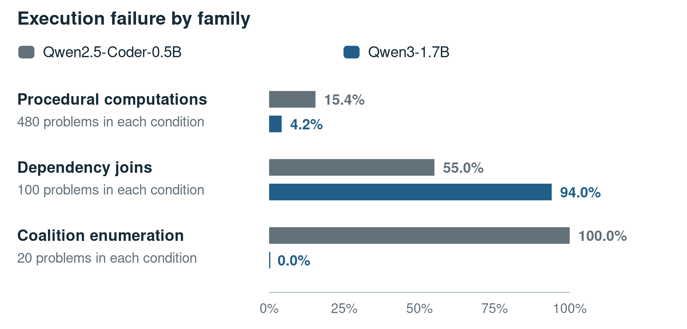
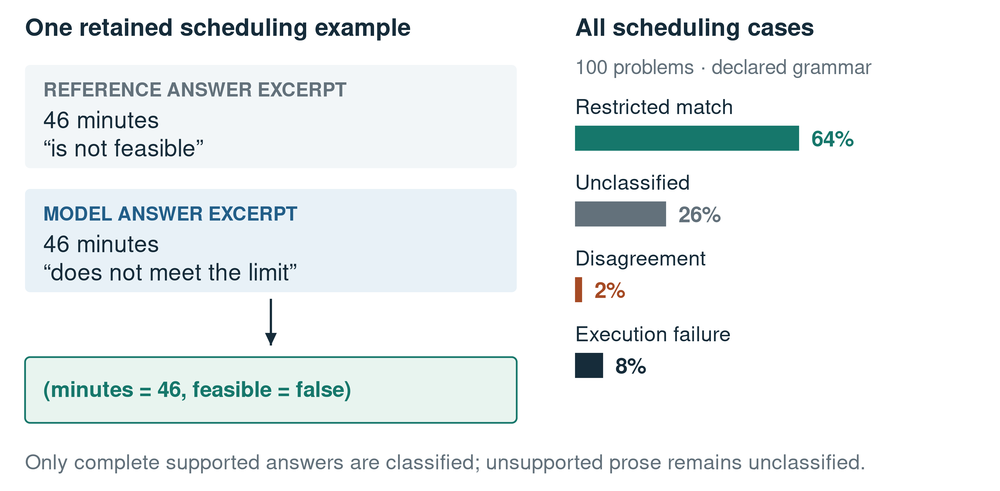

# What executable answers reveal and hide: reusable evidence for evaluating small-model compilation

## Abstract

Background: A model-generated program can execute successfully yet answer the wrong question, while a correct result can be rejected because of wording. Methods: We study these distinctions in SOP Lang, a language of named computations with explicit value dependencies. Experiment A compares adapted Qwen2.5-Coder-0.5B and Qwen3-1.7B systems on 705 shared problems. Analysis B applies restricted answer-equivalence checks to preserved outputs without generating new answers. Results: Normalized exact matching is 51.2% for the 0.5B system and 59.7% for the 1.7B system. This overall ranking conceals opposite family-level behavior: procedural execution failures fall from 15.4% to 4.2%, but dependency-join failures rise from 55% to 94%. For coalition answers, a declared tuple-set comparison changes the 1.7B system's match rate from 25% to 100% on 20 cases. A separate scheduling diagnostic identifies 64% matches, 26% unclassified outputs, 2% disagreements, and 8% execution failures. Conclusions: Model ranking, execution reliability, and answer equivalence answer different questions. The archive supports useful gains and specific remaining limits, rather than a single broad claim about reasoning. We provide reproducible analyses, per-item decisions, and a prospective design for discovering commands that address recurring failures while testing transfer and interpretation separately.

Keywords: open research; small language models; executable evaluation; semantic equivalence; reproducibility; program compilation

## 1. Introduction

A percentage of correct answers is useful only when the reader knows what counts as an answer and what counts as correct. This becomes particularly important when a language model produces a program. The program may fail before returning a value, compute a coherent answer to the wrong task, or return the right result in an unexpected format. A single score can hide these different outcomes.

Program-aided methods make the intermediate computation available for inspection. Gao and colleagues' PAL and Chen and colleagues' Program of Thoughts delegate calculation to executable code [@pal] [@pot]. That creates an opportunity to ask more precise questions than whether a model "can reason." Which programs execute? Which task families improve? Which rejected outputs differ only in form? What evidence would justify accepting them?

We examine those questions using SOP Lang, an executable language developed for a small-model compilation project. Its notation is introduced below. The project contains a substantial archive of successful and unsuccessful training variants. We use that archive to study evaluation, concentrating on one paired model comparison and two restricted answer diagnostics. The complete reconstruction of the broader developmental series remains in the accompanying evidence package.

The research question is how much the interpretation of a small-model result changes when structural validity, execution, family-level performance, and answer equivalence are reported separately. This matters both to model selection and to the next engineering intervention. If failures are concentrated in one recurring computation, a new command may help. If the computation succeeds but the scorer rejects its wording, changing the model may address the wrong problem.

## 2. Methods

### 2.1 SOP Lang in one example

A SOP Lang program is a circuit of named computations called wires. A declaration begins at the start of a line with `@name command`; the following lines form that command's body until the next declaration. A reference such as `$slots` reads another wire's value. References define the dependencies from which the runtime computes execution order.

For "three packs containing four cells each," a complete circuit is:

```sop
@slots literal
{"packs":3,"perPack":4}

@answer jsEval
return $slots.packs * $slots.perPack;
```

The `literal` command turns its JSON body into the value of the wire named `slots`. The `jsEval` command evaluates the JavaScript body of `answer`, reads the two fields through `$slots`, and returns 12. The runtime evaluates `slots` first because `answer` depends on it, not because it is printed first. The caller requests the output named `answer`. Both `slots` and `answer` are naming conventions, not reserved keywords.

Figure 1 separates the program's explicit data from its computation. The model is responsible for both extraction and operation choice. Successful execution does not establish that multiplication is the intended operation in a different problem using the same numbers.


Figure 1. Reading the evaluated representation. A wire is a computation node, a dollar-prefixed reference is a value dependency, and the caller chooses the output. This is an executed illustrative example.

The language also provides specialized commands. A `graphPath` body specifies an undirected edge list and endpoints; the runtime performs traversal. `aggregate` performs supported filtering and reduction, and `fraction` reduces an integer ratio. These commands can remove algorithm implementation from generated text. They still require the model to choose a suitable operation and supply the correct data.

### 2.2 Data construction and study boundary

Problem families originate in source books and procedural generators. Each family supplies a reference parse, answer computation, circuit generator, and provenance. Candidate circuits are executed against expected answers, selected properties are asserted, and input perturbations test sensitivity to problem data. These checks catch concrete defects without proving that the reference parse captures every source condition. Shared assumptions between generator, oracle, and circuit remain possible.

The primary archive contains ten fine-tuning runs with 705 evaluated items each. We recount all outcomes and reapply the original comparator. This article selects the later paired model comparison because it retains identical item identifiers, expected-answer strings, and plan fingerprints across conditions. Other runs provide the separately identified scheduling diagnostic and historical context. No training or model generation is repeated.

The evaluation population is synthetic and structurally concentrated. A representative earlier version contains 28 plan fingerprints across 705 items; a fingerprint identifies a computational form rather than a semantically independent problem. The development team repeatedly inspected this nominal holdout. Following the concern established by Dwork and colleagues for adaptive reuse [@dwork], we treat it as a development benchmark rather than a sealed confirmation set.

### 2.3 Experiment A: two adapted base models

Experiment A compares Qwen2.5-Coder-0.5B-Instruct with Qwen3-1.7B after SOP Lang adaptation. The official model cards identify the releases [@qwen05] [@qwen3]; exact revisions, training completion times, and checkpoint records are supplied in the supplement. The model names are release identities, not an independently recounted parameter census.

Both systems are evaluated on the same 705 identifiers and reference answers. Their training uses full fine-tuning, AdamW at learning rate 0.0001, two epochs, seed 3407, effective batch size 32, maximum sequence length 4,096, and bfloat16 precision. Evaluation uses validation-selected exports, greedy decoding, a 2,048-token cap, and one task attempt. The selected checkpoint and target-token exposure differ, and family and pretraining change with size. This is a comparison of two trained systems, not a controlled scaling law.

### 2.4 Analysis B: what the answer comparator recognizes

The original evaluator separates syntax/graph rejection, execution failure, completed mismatch, and normalized exact match. Exact matching performs specified text normalization and then equality. It does not generally recognize paraphrases or permutations of a valid answer list.

We implement two retrospective diagnostics. The coalition parser accepts complete lists of coalition identifiers and seat counts, canonicalizes member and list order, and rejects duplicate coalitions or repeated members. The scheduling parser accepts complete sentences specifying a safe-integer completion time and a feasibility verdict under a fixed grammar. It permits a known explanatory suffix and rejects contradictory surplus text. Unsupported outputs remain unclassified.

The coalition diagnostic uses the 1.7B condition in Experiment A. The scheduling diagnostic uses a separate earlier 1.7B curriculum with 100 dependency-join cases; these ask when parallel work can finish and whether a time limit can be met. We keep the populations and their purposes separate. The diagnostics do not combine into an overall semantic score, and they do not reconstruct missing historical judgments.

### 2.5 Reporting and reconstruction

All rates below are percentages; table captions state the denominator and comparison population. The machine-readable evidence retains integer counts and item-level decisions. We use descriptive differences because repeated task templates and one run per condition do not justify an inferential sampling model.

The analysis checks unique identifiers, exhaustive outcome partitions, agreement with archived metrics, model identity, paired population continuity, and scorer behavior. Source files have recorded hashes. A separate base-model reanalysis is also included in the package, with common scoring on paired inputs. It is not merged into Experiment A: direct prose and compiled generation use different prompts and budgets, and the Qwen3 base run has substantial missing output.

## 3. Results

### 3.1 Experiment A: an overall improvement with uneven transfer

Table 1 shows the evaluation stages. Both systems achieve 100% syntax and graph acceptance. The 1.7B system has higher execution completion and a normalized exact-match rate of 59.7%, compared with 51.2% for the 0.5B system. The difference is 8.5 percentage points. Paired outcomes favor the 1.7B system on 8.7% of problems and the 0.5B system on 0.1%.

Table 1. Experiment A. Percentages use the same 705 evaluated problems per model. Completion includes exact matches and completed mismatches.

| Adapted model | Syntax and graph accepted | Execution completed | Normalized exact match |
| --- | --- | --- | --- |
| Qwen2.5-Coder-0.5B | 100.0% | 69.6% | 51.2% |
| Qwen3-1.7B | 100.0% | 73.9% | 59.7% |

The aggregate is a useful description of these systems, but it does not show uniform improvement. Table 2 separates the task families most relevant to the next abstraction experiment. Procedural exact matching increases from 75.0% to 86.3%. At the same time, dependency-join execution becomes less reliable: the failure rate rises from 55% to 94%. The larger system is therefore better overall and worse on a particular recurring computation.

Table 2. Experiment A by problem family. Every percentage uses the row's stated sample size for each model. The final row groups the remaining book-derived tasks, which retain distinct records in the supplement.

| Family | Problems | 0.5B exact match | 1.7B exact match | 0.5B execution failure | 1.7B execution failure |
| --- | --- | --- | --- | --- | --- |
| Procedural computations | 480 | 75.0% | 86.3% | 15.4% | 4.2% |
| Dependency joins | 100 | 0.0% | 0.0% | 55.0% | 94.0% |
| Coalition enumeration | 20 | 0.0% | 25.0% | 100.0% | 0.0% |
| Other book-derived tasks | 105 | 1.0% | 1.9% | 61.9% | 66.7% |

Figure 2 visualizes the opposing execution changes. Our interpretation is that the learned procedural repertoire has improved without becoming a general solution to composition or task interpretation. A single overall percentage would obscure precisely the failure family that could motivate a dependency-join command.



Figure 2. Experiment A does not improve every task family. Each pair uses the same problems within its family. Differences describe the two recorded systems and do not isolate model size.

### 3.2 Analysis B: a correct answer can fail text matching

For the 1.7B system's coalition outputs, normalized exact matching accepts 25% of the 20 cases, while the restricted tuple-set comparison accepts 100%. The additional matches follow from explicitly defined equivalence in member order, tuple order, and separators. They do not require accepting arbitrary explanatory prose.

The separate scheduling diagnostic yields 64% restricted matches where exact matching accepts 0%. Of the remaining outputs, 26% lie outside the declared grammar, 2% disagree on the parsed duration or verdict, and 8% fail execution. Table 3 retains these unresolved and failed categories.

Table 3. Analysis B. Coalition percentages use 20 outputs from Experiment A's 1.7B system; scheduling percentages use 100 outputs from the earlier 1.7B curriculum. The populations are not pooled.

| Evaluation outcome | Coalition outputs | Scheduling outputs |
| --- | --- | --- |
| Original exact match | 25% | 0% |
| Restricted match | 100% | 64% |
| Parsed disagreement | 0% | 2% |
| Unclassified | 0% | 26% |
| Execution failure | 0% | 8% |

One saved scheduling circuit computes a 46-minute completion time against a 43-minute limit. Its answer states that the plan "does not meet the limit," while the reference says it "is not feasible." The circuit, duration, and negative verdict agree. Figure 3 shows why a declared answer structure can recognize this agreement without treating every textual mismatch as correct.



Figure 3. A specific answer-equivalence correction. The phrases shown are excerpts from a retained example; acceptance in the actual diagnostic requires the complete supported sentence, not isolated keywords.

## 4. Discussion

### 4.1 What the comparisons tell us

The evidence supports three practical conclusions. First, changing the trained model can improve overall performance without fixing every computation family. Second, structural acceptance is a weak proxy for useful capability when it is already perfect and execution still fails. Third, answer representation can materially change measured performance even when the saved computation is unchanged.

Our interpretation of Experiment A is a redistribution of strengths and failures across the learned repertoire. The procedural improvement is real under the recorded comparator, while the scheduling regression is equally real at the execution stage. This argues for family-specific diagnosis before choosing the next model or curriculum. It does not justify a universal size threshold or a claim that the larger system understands every family better.

Analysis B changes what should be optimized. Coalition formatting errors can be addressed through a task-level output schema or declared equivalence relation. Dependency-join execution failures require a different intervention, such as a better representation or a tested scheduling command. Treating both as generic model errors would conceal this distinction.

The wider archive supplies a constructive reason to investigate new commands: specialized graph, aggregation, and fraction operations accompany an increase from 53.8% to 62.4% exact matching in an earlier paired comparison. This article uses that finding as motivation rather than repeating its full experimental analysis. DreamCoder's learned libraries provide a related motivation for reusable abstractions [@dreamcoder]; the current project has not implemented automatic library discovery.

### 4.2 Rigor with agent-generated research artifacts

Coding agents assisted implementation, teaching-data construction, experimental tooling, analysis, and writing. Their participation does not invalidate the results, but it makes shared assumptions a practical concern. A generator, reference solver, and circuit can agree because all use the same parse. The pipeline's checks establish the properties they actually test, not an independent guarantee of task meaning.

Messeri and Crockett's analysis of AI and scientific understanding explains why such agreement can invite excessive confidence [@messeri]. Our response is to preserve distinct evidence states and per-item decisions. An unclassified answer remains unclassified. A retrospective diagnostic remains retrospective. A proposed command remains proposed until its measured comparison exists. The present audit itself is agent-assisted, not independent peer review.

### 4.3 A new experiment suggested by these failures

The dependency-join family is a concrete candidate for abstraction. A new operation could accept durations and explicit predecessor relations, then compute completion time by propagating predecessor maxima through an acyclic graph. This would remove recurring scheduling implementation from the model's output. It would still leave the model responsible for identifying which branches are parallel and which tasks depend on them.

The test should compare that command against equivalent general-code targets under a common base revision, training-token budget, checkpoint rule, and decoding budget. Several seeds and transfer families frozen before command design are needed. Outcome reporting should distinguish extraction, command selection, execution, and answer-schema agreement. Units-and-rates operations provide another candidate where explicit contracts could prevent a different recurring mistake. Neither extension is claimed as a current result.

## 5. Reuse and reproducibility

The companion artifact [@artifact] contains source hashes, model identities, full reconstructed outcomes, paired comparisons, baseline diagnostics, parser implementations, and item-level decisions. Figures are generated from those derived records. An experiment map links the article's descriptive labels to exact archived runs. Local reconstruction requires the original item records and manifests, whose paths are preserved in that map.

Following Sandve and colleagues' provenance practices [@sandve], the package distinguishes original inputs from derived analyses. Dataset documentation follows the motivation of datasheets [@datasheets], and model identification follows model-card concerns [@modelcards]. These practices help another researcher inspect the analysis; they do not certify its interpretation.

A public deposit has not yet been made. Source books retain their own rights status, and a repository hash does not supply files that a reader cannot access. A complete open-research release must deposit the permitted reconstruction inputs or document legitimate restrictions, provide a persistent identifier, and preserve the distinction between the original scorer and the retrospective diagnostics.

## 6. Limitations and conclusion

The study is retrospective, synthetic, and development-driven, with one training run per reported condition. It has no new external confirmation set, equal-budget ablation isolating execution, or independent semantic relabeling. The restricted diagnostics do not cover arbitrary answers. Base-model comparisons available in the package have their own scorer and response-availability limitations.

The useful result is a more precise account of what the systems can do. The 1.7B adaptation has the higher overall match rate, but worse scheduling execution on the compared family. Some apparent coalition errors disappear under a declared representation of the answer. These findings point to different repairs and a specific next experiment: discover commands that remove demonstrated implementation failures, while testing interpretation and transfer separately.

## Data and software availability

The accompanying local package contains reconstruction scripts, derived evidence, source hashes, figure sources, and diagnostic decisions. Complete reproduction also needs the archived raw inputs. An immutable public deposit and persistent identifier must be supplied before an open-data submission. Local workspace access is not represented as public availability.

## Author contributions, funding, and competing interests

Author identities and roles, funding, and competing-interest declarations require completion. No European Union grant or institutional eligibility is inferred from the project location. Coding-agent assistance is disclosed in Section 4.2; human authors retain responsibility for interpretation and publication.

<!-- REFERENCES -->
