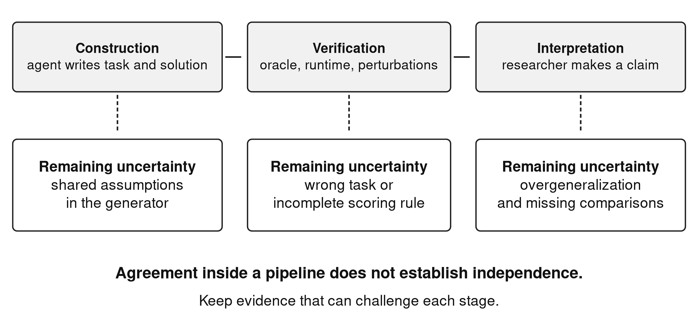
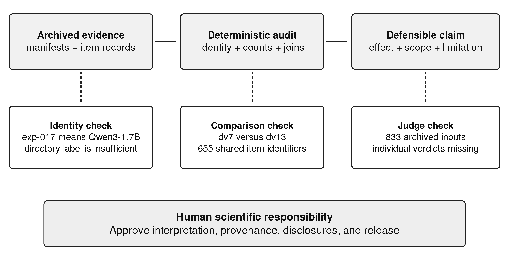

# Executable answers and the limits of delegated understanding: a case for epistemic accountability in agent-assisted research

## Abstract

When a language model produces an executable program, its answer becomes inspectable in a way that fluent prose alone is not. This can strengthen scientific practice, but it can also invite an unwarranted inference from successful execution to correct understanding. This article develops an account of epistemic accountability through a concrete case of coding-agent-assisted research on small language models. An audit of ten archived experimental arms, comprising 7,050 item records, finds a real benefit from more abstract computational operations: normalized exact matches rise from 379/705 to 440/705, while procedural execution errors fall from 63/480 to 13/480. The same archive reveals persistent failures, changed evaluation populations, a misleading model-size label, and missing decisions behind a semantic evaluation summary. These findings support a distinction between computational delegation, evidential independence, and scientific responsibility. A tested operation can reduce implementation error without validating the interpretation encoded in its inputs. An agent-assisted audit can make evidence inspectable without becoming independent peer review. We argue that useful abstractions should expose their exclusions, that uncertainty should remain attached to the claim it limits, and that humans retain responsibility for interpretation and publication. Future research should discover new executable abstractions while testing whether they improve transfer and preserve contestability.

Keywords: epistemic accountability; artificial intelligence; scientific practice; coding agents; abstraction; small language models

## 1. Introduction

A program that runs is persuasive evidence of something. It shows that an implementation can carry out a sequence of operations under stated conditions. The temptation is to let that evidence do more work than it can: to treat execution as proof that the problem was understood, a passed test as proof that the data are correct, or a reproduced table as proof that its interpretation is sound.

That temptation becomes consequential when coding agents participate in several stages of research. The agent may help write the data generator, the reference solver, the tests, and the article. Agreement among these outputs can then appear to be corroboration even when they inherit the same mistaken assumption. The issue is not whether any one artifact is useful. It is whether the relation between them supplies independent reasons to trust the scientific claim.

Messeri and Crockett describe how AI can create illusions of understanding in scientific work [@messeri]. Their argument directs attention to the gap between increased production and justified understanding. This article examines that gap through a specific technical case rather than a general prediction about scientific automation. The case is a research system that fine-tunes small language models to compile word problems into executable circuits.

The research question is what makes computational delegation a justified source of scientific evidence when agents also help construct the checks and the interpretation. This matters because a workflow can become more productive and internally consistent without becoming better justified. Our argument is that delegation strengthens research when its boundaries remain visible. A narrow executable operation can remove a real source of error, while its contract excludes cases and embeds choices about admissible problems. Epistemic accountability requires a reader to be able to challenge the interpretation, the measurement, and the proposed mechanism separately.

We develop this argument from an audited experimental archive. The archive contains a substantial positive result for more abstract operations, a negative result for additional decomposition, and several corrections to earlier interpretations. These are not observations of social deployment or a human-subject study of trust. They provide a concrete basis for reasoning about the responsibilities that arise when agents help produce scientific evidence.

The ethical stake is the obligation to represent the grounds of a claim fairly to readers who may build on it. Calling an internally consistent result independently verified can shift the work of discovering its assumptions onto those readers. A misleading model comparison can similarly affect another team's choice of system or experimental budget. We do not measure such downstream consequences here. We identify the reporting choices that determine whether readers can assess those risks for themselves.

## 2. Delegation, abstraction, and reasons for belief

### 2.1 What execution changes

PAL demonstrates how a language model can translate a natural-language problem into a program and delegate the computation to an interpreter [@pal]. Program of Thoughts uses a related separation for numerical reasoning [@pot]. This changes what a reviewer can inspect. A returned number has a computational history that can be read, executed, and challenged.

The gain is real. Arithmetic need not depend on a language model repeatedly predicting the next token of a calculation. Yet the program embodies an interpretation before the interpreter begins. If the model translates a parallel schedule into a sequential one, a correct interpreter will faithfully compute the wrong schedule. Execution supplies evidence about the program, while the relation between program and problem remains a further claim.

Program synthesis makes the role of the specification explicit [@synthesis]. The specification is not a neutral input whose adequacy can always be assumed. In natural-language compilation, it includes decisions about which quantities matter, what a relation means, and which outputs count as equivalent. Those decisions may be distributed across model prompts, training examples, command contracts, and evaluation code.

### 2.2 Abstraction includes exclusions

An abstract operation hides implementation work by exposing a smaller interface. A graph-reachability command can remove the need to generate a queue and a visited set. It must also choose a graph model: directed or undirected, weighted or unweighted, with some rule for absent nodes and repeated edges. These choices are part of the operation's meaning.

Selbst and colleagues show how abstraction in sociotechnical systems can omit context that matters to the problem being addressed [@selbst]. Our case is narrower than their fairness analysis, but the conceptual connection is useful. A successful formal operation does not establish that the formalization retained every relevant distinction. In the word-problem setting, the excluded distinction may be directionality or units. In a future social application, the excluded distinction could be a contested category or a contextual exception. The present experiments do not validate such applications.

DreamCoder offers a computational account of why reusable abstractions can help synthesis [@dreamcoder]. The current project shares that motivation, although its operations were developed through human-directed work assisted by coding agents. The open question is how to discover new operations that improve learning without making their assumptions harder to inspect.

### 2.3 Accountability differs from internal agreement

Raji and colleagues describe auditing as a documented process across an AI system's development lifecycle [@raji]. This is relevant to research because a scientific claim also depends on a lifecycle: source selection, data construction, training, evaluation, interpretation, and release. Internal agreement between artifacts is useful only when the question each artifact answers is clear.

We use epistemic accountability to mean that the grounds and limits of a claim are available for challenge, and that identifiable human authors accept responsibility for its interpretation and publication. It does not require a human to recompute every arithmetic operation. It does require that automated checks not be described as evidence of questions they never assessed.

## 3. Case and analytical basis

The case system, SOP Lang, represents a solution as named computational wires. A small model emits a circuit; a runtime checks dependencies and executes the selected commands. Literal wires state problem values, JavaScript wires express general computation, and specialized wires perform operations such as graph reachability, aggregation, and fraction reduction. Every explicit dependency is part of the inspectable program.

The teaching pipeline constructs parameterized problem families with reference parses, answer computations, circuit generators, and provenance. It executes candidate circuits and compares their answers with expected values. Assertions check selected conditions, and input perturbations help detect answers that ignore their stated inputs. This is a substantive attempt at data rigor. It does not make the reference parse and circuit semantically independent when they share the same family definition.

The empirical basis is a retrospective reconstruction of ten archived arms, each evaluated on 705 items, for 7,050 item records in total. The analysis recounts outcomes, checks model metadata, joins item identifiers across versions, reapplies the original comparator, and inspects generated commands. It does not rerun training or collect participant data. Coding agents assisted both the original research and the present evidence analysis and writing; the audit is therefore not represented as independent human review.

The main evaluation slice contains 480 procedural items and 225 book-derived items. In the dv7 version, these correspond to 28 distinct plan fingerprints. Several book-derived subsets repeat a single computational plan. The benchmark was inspected during development, which limits its role as a test of unseen research decisions. Dwork and colleagues' work on adaptive holdout reuse explains why repeated consultation changes the evidential status of a nominal test set [@dwork].

The analysis is an argument from a bounded case. It can show where a particular justification succeeds or fails and identify obligations for similar workflows. It cannot measure how often researchers overtrust agents, whether agents outperform human research assistants, or whether the resulting practices improve social outcomes. These would require different studies.

## 4. What survives the audit

### 4.1 Abstract operations help in a concrete comparison

The strongest positive result comes from an early vocabulary change using Qwen2.5-Coder-1.5B-Instruct. Normalized exact matches increase from 379/705 to 440/705. Within the 480 procedural items, matches increase from 377 to 440 and execution errors fall from 63 to 13. The paired evaluation retains the same item identifiers and oracle strings. The revised vocabulary places graph, aggregation, and fraction algorithms inside narrower commands.

This is evidence that the representation asked of a small model can materially affect its success. It supports a constructive conclusion: scientific attention should be directed to the interface between model and executor, rather than only to the model's nominal size. The comparison has one archived run per condition and incomplete early training metadata, so it does not establish a general causal effect. Its value lies in a strong development signal with an explicit boundary.

Table 1 summarizes the observations used in the argument. Counts are retained because a percentage without its denominator can imply a breadth the sample does not have.

Table 1. Empirical observations and the claims they support.

| Observation | Supported reading | Limit |
| --- | --- | --- |
| Matches rise from 379/705 to 440/705 after specialized wires | Target vocabulary is a promising design variable | One run per condition; incomplete early training metadata |
| Procedural execution errors fall from 63/480 to 13/480 | Some implementation burden can move into tested operations | Correct command selection remains necessary |
| More decomposed targets raise execution errors from 57/705 to 135/705 | Additional structure can increase coordination failure | This does not reject modularity in general |
| Syntax and graph acceptance is 705/705 in every selected arm | The model learns the outer program form | Structural validity does not establish task correctness |
| A restricted coalition check accepts 20/20 where text matching accepts 5/20 | Some apparent errors are answer-format differences | The diagnostic applies to one declared output grammar |

### 4.2 Additional structure can make performance worse

A later Qwen3-1.7B curriculum reaches 460/705 normalized exact matches. Splitting targets into more explicit wires reduces that count to 448/705 and raises execution errors from 57/705 to 135/705 on unchanged evaluation identifiers and oracle strings. A locally shorter computation can therefore produce a less reliable whole when it adds dependencies and bindings the student must coordinate.

This negative result is epistemically important because it resists the architecture's own attractive story. If abstraction is useful, it is easy to assume that greater explicitness or more components will also be useful. The data require a distinction between an operation that removes recurring algorithmic work and a decomposition that redistributes the same work across more interfaces. The latter can increase the task's coordination burden.

Neither observation licenses a universal account of model limits. The dv13 Qwen2.5-Coder-0.5B system matches 361/705 and the Qwen3-1.7B system matches 421/705, but family and pretraining change together with size. Describing this as a demonstrated size threshold would turn a comparison of two systems into a law the experiment was not designed to test.

### 4.3 A correct count can accompany an incorrect story

The archive identifier `exp-017-qwen3-17b` had encouraged a comparison with a purported 17B model. Its nested metadata identifies Qwen3-1.7B. The item counts remain real, but their use as evidence that a small model beats a model ten times larger is invalid. This is a failure of interpretation at the identity boundary, not a failure to run an experiment.

A similar problem appears in the evaluation population. Dv7 and dv13 both contain 705 items, but 50 identifiers are replaced and 100 oracle strings change among the 655 shared items. A table with the same denominator can therefore invite an unsupported fixed-test comparison. The necessary correction is specific: report population continuity before interpreting a score change.

Mechanism claims require another kind of inspection. A container-oriented curriculum changes coalition matches from 0/20 to 20/20, but none of the 20 successful evaluated outputs declares a container-family command. The result supports a curriculum-associated improvement on one coalition plan. It does not show that executing containers caused the improvement or that an entire reasoning book was solved. Inspectable programs make this distinction possible.

### 4.4 Semantic generosity also needs a contract

The original comparator normalizes text and then tests equality. Some mathematically correct outputs fail because their wording or list punctuation differs. A restricted coalition parser accepts 20/20 outputs in one arm where text matching accepts 5/20. A dependency-join parser accepts 64/100 outputs in another arm where the original comparator accepts 0/100. The latter parser leaves 26 answers outside its grammar, records two parsed disagreements, and preserves eight execution failures.

These diagnostics avoid two extremes. They do not declare every textual mismatch a reasoning failure. They also do not grant an unconstrained evaluator authority to decide what the answer “really means” without preserving the decision. Each accepted diagnostic has a stated grammar and inspectable parsed values. An abstention remains an abstention.

An earlier semantic summary lacks that traceability in the surviving archive. Its 833 judgment inputs remain, but the corresponding decisions and rationales do not. The aggregate is therefore excluded from the article's evidence. This does not prove that its judgments were false. It establishes that readers cannot reconstruct the claimed support from the available record.

Figure 1 distinguishes the questions answered at construction, verification, and interpretation.

Figure 1. Distinct obligations in agent-assisted research. Agreement within one stage does not automatically answer the question posed at the next stage.

## 5. Epistemic obligations of an executable workflow

### 5.1 Keep verification local to the property checked

The word “verified” can collapse several claims. A parser verifies a syntax condition. A test compares an output with a reference. A perturbation check establishes sensitivity to selected changes. A reviewer assesses whether the reference represents the intended task. These operations have different objects and different failure modes.

In the case, every selected arm passes syntax and graph checks on all 705 items. Many programs still fail execution or return mismatched answers. This is a direct demonstration that structural acceptance has a limited scope. Calling the runtime “formally verified” would be stronger still; the project provides an implementation with tests, not a formal proof of its semantics.

The practical obligation is to attach verification language to the property actually checked. “The archived comparator labels were reproduced” is informative. “The research was verified” hides which parts of the reasoning remain open. The same applies to data quality: executable checks strengthen the training pipeline without establishing that all source interpretations are correct.

### 5.2 Preserve evidential independence as a question

An oracle can be wrong in the same way as the program it checks. This is particularly plausible when both are constructed from the same reference parse or by the same agent-assisted process. More tests can increase coverage while leaving that shared assumption untouched.

Datasheets encourage documentation of a dataset's motivation, composition, construction, and intended use [@datasheets]. Model cards encourage disclosure of a model's identity, evaluation conditions, and limits [@modelcards]. In this workflow, such documentation should also state which checking components share an origin. A reference computation written separately at the code level may still depend on the same semantic reading of the problem.

Evidential independence is therefore a design question, not a label granted by having two files. A future experiment can strengthen it through independently authored transfer tasks, alternative reference methods, and targeted human review of ambiguous cases. None of those should be claimed after the fact when the artifacts do not document them.

### 5.3 Make uncertainty travel with the claim

Uncertainty is often collected in a limitations section after a strong headline has already fixed the reader's impression. The case suggests a more exact practice. The missing early manifest belongs beside the abstraction comparison. The absent judge decisions belong beside the semantic aggregate. The changed population belongs beside the cross-version score. These are not generic caveats; they determine what each result means.

Sandve and colleagues' reproducibility rules support keeping transformations executable and records recoverable [@sandve]. The further requirement is interpretive: a reproduced number should retain the conditions under which it answers the research question. This makes disagreement productive. A critic can accept the arithmetic and challenge the causal inference without being forced to reject the whole experiment.

### 5.4 Retain human responsibility without pretending to human omniscience

Human authors cannot inspect every internal computation of every model used in research. They can still take responsibility for deciding what evidence is sufficient, stating what remains unknown, preserving the record, and correcting claims. Delegating code generation or analysis does not transfer those obligations to an agent.

This article itself uses agent assistance and should be judged by the same standard. Its executable reconstruction reduces specific mistakes and makes others easier to detect. It does not certify that the interpretation is free of bias or that the audit is independent. The disclosure is substantive because it identifies where the tools participated, rather than treating their use as either disqualifying or irrelevant.

### 5.5 Duties to readers and future users

The obligations above extend beyond an author's confidence in a result. Readers need an accurate account of what was checked because they cannot reconstruct every experiment before deciding whether to invest in a replication or application. A declaration of agent assistance is useful when it identifies the affected stages and their review conditions. A generic disclosure that “AI was used” does little to distinguish language editing from generating an oracle or assigning evaluation judgments.

A corresponding duty is to preserve failures that constrain the claim. The negative decomposition result changes the practical recommendation: additional wires should be tested for coordination costs, not adopted because modularity sounds desirable. The unsupported semantic aggregate presents a different duty. When its individual decisions are absent, a publication should withhold the aggregate as evidence even if doing so makes the headline less impressive. This restraint follows from the reader's need to inspect the justification, rather than from a presumption that automated judgments are always unreliable.

These duties are proportionate to the use being proposed. A preliminary study may publish useful exploratory evidence without completing every future control. It should not describe that evidence as a validated basis for consequential deployment. The distinction permits open scientific progress while preserving readers' ability to decide what additional checking their intended use requires.

## 6. From new wires to a contestable research programme

The positive abstraction result opens a specific research direction: search for new wires that remove repeated implementation failures while retaining explicit assumptions. A dependency-join operation might compute a critical path from a stated task graph. A units-and-rates operation might reject dimensionally incompatible quantities. A constraint interface might delegate satisfiability checking to an established solver. These are proposals whose scientific value depends on new experiments.

The discovery process should use development traces while reserving a frozen transfer set. Each candidate should disclose its contract, excluded cases, implementation, and tests. Evaluation should compare equivalent tasks and token budgets across several training seeds, report command-selection and argument-extraction failures, and retain negative results. A shorter program is not sufficient evidence of a better abstraction if it hides an incorrect premise.

There is also a question about what remains contestable after abstraction. If a wire compresses a disputed decision into a single opaque command, it may make the model's output shorter while making the scientific claim harder to challenge. A useful research abstraction should expose the values and relations on which the result depends. Its exclusions should be readable to someone examining why a particular problem was accepted or rejected.

Figure 2 shows how a preserved audit chain makes these separate challenges possible.

Figure 2. A practical route to contestability. The record should support challenges to identity, measurement, and mechanism separately; it cannot replace human responsibility for release.

The societal implications remain conditional. Smaller models and explicit operations may eventually support accessible local research tools, but the present study measures neither energy savings nor equitable access. Synthetic word problems do not establish suitability for public administration, education decisions, or other consequential uses. The transferable lesson concerns the form of justification: an executable result should make assumptions available for challenge rather than conceal them behind technical fluency.

## 7. Conclusion

Executable answers can improve the evidential quality of model-assisted research. In this case they make it possible to retain a substantial abstraction result, identify a failed decomposition change, and correct claims about model identity, population continuity, and mechanism. Their value depends on keeping execution, interpretation, and responsibility distinct.

The next research step is to discover new wires under stronger experimental controls and ask which ones improve transfer without obscuring assumptions. The broader obligation is already clear: agents may help construct the evidence, but the scope of a scientific claim must remain answerable to that evidence and to the humans who publish it.

## Data availability and use of AI-assisted tools

An accompanying evidence package, provided as Online Resource 1, contains the reconstructed counts, comparison records, restricted diagnostic decisions, and analysis scripts. The review manuscript omits identifying repository links and author metadata. The package requires anonymization and a stable review-access location before double-anonymous submission. Coding-agent assistance is described in Sections 3 and 5.4. Funding, competing interests, contributor identities, and acknowledgements belong in the separate author information file and require confirmation before submission.

<!-- REFERENCES -->
