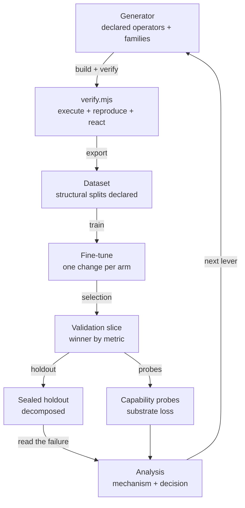

# 2. Method

The pipeline is a closed loop: data is *declared*, *verified*, *exported*, *taught*, and *measured*, and each measurement decides the next change. Every stage is reproducible from source, and every number below names the command that reproduces it.

## The generator: declared operators, families, statements, oracles

Training data does not come from scraping or from a human writing thousands of solutions. It comes from a generator with one authority per operator. Each operator declares its input type, output type, its computation, the sentence it renders, and the clause its sampler must satisfy; a composition is a declared chain of operators with a fixed depth, and each composition becomes one *family*. A family implements the full contract — `sample`, `statement`, `parse`, `solve`, `render`, `explain` — so the drawn statement round-trips through the family's own parse, and the emitted circuit agrees with a family oracle computed by an independent route.

The book families (decompose-to-solve, world-as-a-system, scientific-reasoning, and the other seeded books) are treated the same way: their compute bodies are the reference solutions, and their printed answers are the oracle. The generated procedural-arithmetic families are the newest tranche, built on the declared composition inventory (`teacher/procedural/compositions.mjs`), which currently declares 53 operator-chain compositions and names 11 of them as held out.

## The verification contract

A circuit is admitted into the dataset only if it satisfies, in every phase:

1. **It executes.** `node training-data/verify.mjs` scans every shipped `solution.sop`, executes every circuit without model bindings, and compares the executed answer with the printed answer of its manifest row. Every printed answer is reproduced.
2. **It reacts to its inputs.** The provenance battery perturbs the `slots` literal and requires the answer to change; a circuit whose answer is not a function of its inputs is flagged, not silently accepted.
3. **The family round-trips.** Family round-trip and oracle tests (`tests/procedural.test.mjs`, `tests/composition-tranche.test.mjs`, `tests/scheduling-tranche.test.mjs`) hold the generator honest before a single row is written.

Reactivity is the property that distinguishes a plan from a template: a plan that reproduces its printed answer for one set of numbers but not for a perturbed set is a memorized constant, and the checker rejects it.

## The structural splits: whole compositions held out

A split is a *declaration*, never a filter applied after results. The composition inventory is the authority: held-out chains are named in `HELD_OUT` before any instance is rendered, reserved compositions get zero training rows, and the split is verified by count after every rebuild. The consequence is that the holdout rows are compositions the trainer never saw in any form — not unseen wording of a known plan, but unseen plan structure. A plan fingerprint is the `facts` body plus the compute structure, so two rows sharing a plan stay on one side of the split.

## The training recipe

Every full-fine-tuning arm shares one frozen recipe so that the only variable is the change under test: 3 epochs at an effective batch of 32 (per-device batch 4 with gradient accumulation 8), AdamW with a cosine schedule and 3% warmup, gradient checkpointing, seed 3407, a maximum sequence length of 4096, and a declared device-memory budget. The later Qwen3-1.7B arms switch to 2 epochs at the same learning rate (1e-4) and a save cadence of 150 steps. The data version is a counter in the dataset's `VERSION` file with a human label, and it enters the arm name (`exp-018-1.7b-qwen3-dv4`), so a name alone states size, base, and data version.

## The evaluation chain

Selection scores every saved checkpoint on a validation slice (the D11 slice, 339 rows, of which 323 sit on plan fingerprints that also occur in training and 16 do not) and picks a winner by primary metric, not by training loss. The winner then runs the sealed holdout, reported decomposed (reserved compositions, old families, real target data) rather than as one aggregate. Capability probes score the same served artifact for substrate loss: whether the narrow SOP Lang mixture cost the model its general instruction and JavaScript behavior.

## The prose baselines

Each untrained base answers the eval statements *in prose*, and the completion is compared against the printed answers (numeric answers credited only when every printed number appears; non-numeric by normalized containment). Asking an untrained base to emit SOP Lang would be meaningless; the prose comparison is the honest floor.

## The chat surface

The deployed interface serves the newest winner and lets a user type a statement and receive a compiled circuit and its executed answer. A failed plan (parse, wrapper, or execution failure) is retried with the full numbered failure history fed back — retries are *deployment*, and the scored evaluations stay single-shot by contract. Every model block states its identity as the owner reads it: size, base, data version, and training finish time.

## The loop

The loop is the point: every arm is a hypothesis recorded before it runs, every result is decomposed, and every decision names the lever the next arm will pull. The rest of this article is that loop, one turn at a time.
