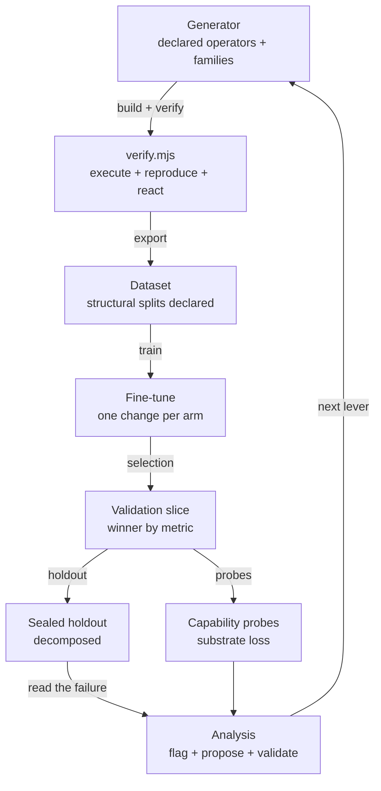

# 2. Method

The pipeline is a closed loop: data is *declared*, *verified*, *exported*, *taught*, and *measured*, and each measurement decides the next change. The loop is run by a coding agent, and the procedure below — the gates and the skills — is itself part of the artifact, not an anecdote about it.

## The abstraction-learning loop

The series runs a standing cycle of five steps, each leaving a written record before the next begins.

1. **Measure.** Every arm's holdout is decomposed into the seven-class outcome ladder, per book and per plan cluster, so a failure is read as a *class* and a *wire*, not a percentage.
2. **Flag.** Two skills turn the raw failures into candidates. `wire-discovery` ranks every recurring `jsEval` shape in the shipped suite by (frequency × mean-lines × error-share); `data-quality` flags bodies that have outgrown a single wire (the bloat indicator: wires per plan against `jsEval` lines per plan).
3. **Propose.** A wire is proposed with its contract, its measured line reduction, and the error class it makes impossible. A proposal that only renames a one-line expression is rejected as prettification.
4. **Validate.** The proposal lands only after the family round-trip and oracle tests pass and `node training-data/verify.mjs` reproduces every printed answer and proves every circuit reacts to its inputs.
5. **Measure again.** The next arm holds everything else fixed and measures the change against the prior baseline. A measured win keeps the command; a measured null or loss rejects it.

Two results show the loop works in both directions. The container family shipped because it moved world-as-a-system 0 → 20/20. The gratuitous-modularity control (dv8) measured *worse* — execution errors doubled — and the conclusion was written accordingly: "structure is real but gratuitous splitting costs." A loop that only ever confirmed its hypotheses would not be distinguishable from a narrative.

## The wire vocabulary

A circuit is a set of named wires, each a value with declared dependencies; the runtime resolves the graph and executes in dependency order. The model composes from a small, fixed vocabulary, and every command below exists because a recurring transcription was moved out of the model's body:

- `jsEval` — an isolated JavaScript stage, the catch-all from which everything else is carved.
- `literal` — a declared value, typically the extracted problem `slots`.
- `graphPath` — adjacency-map traversal (replaces a hand-written BFS).
- `aggregate` — a filter-then-reduce pair (replaces hand-rolled list loops).
- `fraction` — greatest-common-divisor reduction and proportional arithmetic.
- the **container family** — `container` (schema + identity policy), `containerAdd` / `containerUpsert` / `containerRemove` (staged patches), and `containerFilter` (a provenance-keeping view). It replaces the hand-rolled lists, membership checks, and merge logic of the book families' longest bodies.

The rule that governs growth is measured, not aesthetic: a candidate command must absorb a multi-line transcription that demonstrably produces errors. The one-line operations (division, modulo, unique-count) were proposed and rejected on that rule.

## The generator: declared operators, families, statements, oracles

Training data does not come from scraping or from a human writing thousands of solutions. It comes from a generator with one authority per operator. Each operator declares its input type, output type, its computation, the sentence it renders, and the clause its sampler must satisfy; a composition is a declared chain of operators with a fixed depth, and each composition becomes one *family*. A family implements the full contract — `sample`, `statement`, `parse`, `solve`, `render`, `explain` — so the drawn statement round-trips through the family's own parse, and the emitted circuit agrees with a family oracle computed by an independent route.

The book families (decompose-to-solve, world-as-a-system, scientific-reasoning, common-sense, and the other seeded books) are treated the same way: their compute bodies are the reference solutions, and their printed answers are the oracle. The generated procedural-arithmetic families are the newest tranche, built on the declared composition inventory (`teacher/procedural/compositions.mjs`), which declares operator-chain compositions and names a subset of them as held out.

## The verification contract

A circuit is admitted into the dataset only if it satisfies, in every phase:

1. **It executes.** `node training-data/verify.mjs` scans every shipped `solution.sop`, executes every circuit without model bindings, and compares the executed answer with the printed answer of its manifest row. Every printed answer is reproduced.
2. **It reacts to its inputs.** The provenance battery perturbs the `slots` literal and requires the answer to change; a circuit whose answer is not a function of its inputs is flagged, not silently accepted.
3. **The family round-trips.** Family round-trip and oracle tests (`tests/procedural.test.mjs`, `tests/composition-tranche.test.mjs`, `tests/scheduling-tranche.test.mjs`) hold the generator honest before a single row is written.

Reactivity is the property that distinguishes a plan from a template: a plan that reproduces its printed answer for one set of numbers but not for a perturbed set is a memorized constant, and the checker rejects it.

## The structural splits: whole compositions held out

A split is a *declaration*, never a filter applied after results. The composition inventory is the authority: held-out chains are named before any instance is rendered, reserved compositions get zero training rows, and the split is verified by count after every rebuild. The consequence is that the holdout rows are compositions the trainer never saw in any form — not unseen wording of a known plan, but unseen plan structure. A plan fingerprint is the `facts` body plus the compute structure, so two rows sharing a plan stay on one side of the split.

## The training recipe

Every full-fine-tuning arm shares one frozen recipe so that the only variable is the change under test: 3 epochs at an effective batch of 32 (per-device batch 4 with gradient accumulation 8), AdamW with a cosine schedule and 3% warmup, gradient checkpointing, seed 3407, a maximum sequence length of 4096, and a declared device-memory budget. The later Qwen3-1.7B arms switch to 2 epochs at the same learning rate (1e-4) and a save cadence of 150 steps. The data version is a counter in the dataset's `VERSION` file with a human label, and it enters the arm name (`exp-018-1.7b-qwen3-dv4`), so a name alone states size, base, and data version.

## The evaluation chain

Selection scores every saved checkpoint on a validation slice (the D11 slice, 339 rows, of which 323 sit on plan fingerprints that also occur in training and 16 do not) and picks a winner by primary metric, not by training loss. The winner then runs the sealed holdout, reported decomposed (reserved compositions, old families, real target data) rather than as one aggregate. Capability probes score the same served artifact for substrate loss: whether the narrow SOP Lang mixture cost the model its general instruction and JavaScript behavior.

## The two scorers

The benchmark's original answer comparison is exact-phrase based: a generated answer matches only if it reproduces the recorded answer's wording. The series' own sanity experiment (chapter 4) showed that a competent writer computes ~18/20 holdout items but scores 2/20 under this scorer, so every trained model's holdout was re-scored with a meaning-based judge: an answer counts as correct when it states the same values and the same verdict/selection as the oracle, regardless of wording, order, unit naming, punctuation, or explanatory prose. Execution errors are never rescued by either scorer.

## The prose baselines

Each untrained base answers the eval statements *in prose*, and the completion is compared against the printed answers (numeric answers credited only when every printed number appears; non-numeric by normalized containment). Asking an untrained base to emit SOP Lang would be meaningless; the prose comparison is the honest floor.

## The coding-agent procedure

The whole loop — generator, verification, training, evaluation, analysis, and the next proposal — is executed by a coding agent following the portable skills in `skills/`: `training-rules` (the measured laws), `training-runbook` (the end-to-end procedure), `wire-discovery` and `data-quality` (the flagging tools), and `night-orchestration` (the discipline for unattended runs). The gates are the load-bearing part:

- **One worker at a time.** A second concurrent trainer corrupts the first's outputs; the launcher refuses rather than warns.
- **A preflight gate** that checks for no other worker, no duplicate supervision, enough disk, and no resume from an incomplete checkpoint.
- **The completion signal is an artifact, not a log line** — a failed chain also writes "done", so the watcher waits for the result artifact, never for a tail of the log.
- **A disk guard** that warns below 40 GiB and stops work below 16 GiB, and a watcher that keeps waiting on a stale failure line instead of exiting (an exited watcher kills the queue silently).

These gates are not administrative color; each one exists because a night was lost when it was absent (chapter 5).

## The loop

```mermaid
graph TD
  G["Generator<br/>declared operators + families"] -->|"build + verify"| V["verify.mjs<br/>execute + reproduce + react"]
  V -->|"export"| D["Dataset<br/>structural splits declared"]
  D -->|"train"| T["Fine-tune<br/>one change per arm"]
  T -->|"selection"| S["Validation slice<br/>winner by metric"]
  S -->|"holdout"| H["Sealed holdout<br/>decomposed"]
  S -->|"probes"| P["Capability probes<br/>substrate loss"]
  H -->|"read the failure"| A["Analysis<br/>flag + propose + validate"]
  P --> A
  A -->|"next lever"| G
```

The loop is the point: every arm is a hypothesis recorded before it runs, every result is decomposed, and every decision names the lever the next arm will pull. The rest of this article is that loop, one turn at a time.
