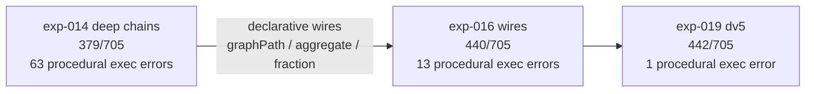

# 4. Results

Every number here is reproduced from the experiment's own registry folder (`report.md`, `items/holdout.jsonl`, `run-manifest.json`) or from the analysis command `node evaluation/analyze-holdout.mjs --experiment <id>`. Percentages carry their counts.

## The untrained bases, in prose

Each base answered the eval statements directly; the completion was compared against the printed answer.

| base | items | matched | rate |
| --- | --- | --- | --- |
| 0.5B code base | 585 | 63 | 10.8% |
| 1.5B code base | 585 | 30 | 5.1% |
| 1.5B general base | 705 | 80 | 11.3% |
| Qwen3-1.7B base | 705 | 357 | 50.6% |

The point of the floor: no untrained base reliably solves these statements in prose, and the 1.7B base's prose number is inflated by the procedural-arithmetic book (70.2% there) while it fails the reasoning books almost entirely. The compiled student is measured against this floor, not against zero.

## The compiled arms

The suite grew as the procedural generator entered the tree: the census arms measured 585 holdout rows (425 for the first composition run), and every arm from `exp-014` onward measured 705. The four-number contract is parse validity, graph validity, runtime completion, and oracle match.

| arm | base / change | items | parse | graph | completion | oracle match |
| --- | --- | --- | --- | --- | --- | --- |
| `exp-011-compositions` | first composition inventory | 425 | 100.0% | 100.0% | 50.6% | 161/425 (37.9%) |
| `exp-012-census` | census operations | 585 | 100.0% | 100.0% | 51.6% | 258/585 (44.1%) |
| `exp-013-1.5b` | 1.5B base | 585 | 100.0% | 100.0% | 72.3% | 322/585 (55.0%) |
| `exp-014-deep-chains` | deeper operator chains | 705 | 100.0% | 100.0% | 71.5% | 379/705 (53.8%) |
| `exp-015-deep-chains-05` | same, 0.5B base | 705 | 100.0% | 100.0% | 67.5% | 362/705 (51.3%) |
| `exp-016-wires` | declarative wires | 705 | 100.0% | 100.0% | 75.2% | 440/705 (62.4%) |
| `exp-017-qwen3-17b` | 1.7B base | 705 | 100.0% | 100.0% | 78.4% | 442/705 (62.7%) |
| `exp-018-1.7b-qwen3-dv4` | Qwen3-1.7B, dv4 | 705 | 100.0% | 100.0% | 73.6% | 436/705 (61.8%) |
| `exp-019-1.7b-qwen3-dv5` | Qwen3-1.7B, dv5 | 705 | 100.0% | 100.0% | 84.4% | 442/705 (62.7%) |
| `exp-021-1.7b-qwen3-dv7` | dv7 baseline (monolithic) | 705 | `{{TODO: exp-021 parse}}` | `{{TODO: exp-021 graph}}` | `{{TODO: exp-021 completion}}` | `460/705 (65.2%), world-as-a-system 20/20` |

The ceiling is the finding: after the wires arm reached 62.4%, neither a 1.7B base (62.7%) nor the dv4/dv5 data revisions (61.8%, 62.7%) moved the oracle-match rate meaningfully. What *did* move across the last arms is where the failure sits. In `exp-019` runtime completion reached 84.4% and procedural-arithmetic execution errors fell to a single row — the model now runs on most of the suite, and the residual error is answering the wrong question, not breaking.

## The first series, for completeness

Before the composition inventory, the series established the coverage law on the book suite (225 holdout rows) and the widened suite (265). The ladder is worth keeping in view: `exp-003-sft-lr1e-4` scored 98.8% plan-seen and 0/225 holdout; widening the plan set (`exp-005`) produced the first non-zero holdout (1/265); teaching intermediate structure (`exp-007`, `exp-008`) raised runtime completion from 12.8% to 30.9% on unseen families without buying correctness (still 1/265). The contrastive arm (`exp-010`) taught the sharpest lexical distinction (7 of 8 "above" vs "at least" pairs) and nothing else (0 of 8 direction pairs). These arms are the reason the census turned to whole-composition structural splits.

## The wire-adoption effect

The declarative wires moved two numbers at once: +61 correct answers, and procedural execution errors from 63 to 13. The failure class they removed was not "the model cannot compute"; it was "the model mis-transcribes a 16-line BFS or a filter-then-reduce pair" — a class that disappears when the transcription leaves the model's body entirely.

## The bloat indicator

The static data-quality checker reports the structure debt on the current suite: **2.19 wires per plan** against **15.4 `jsEval` lines per plan** (7.0 lines per wire), with **1,468 plans** (13.8%) carrying at most three wires but more than 25 `jsEval` lines. These are the monolithic book-family bodies the structure experiment is designed to refactor, holding statements, oracles, and printed answers fixed.

| indicator | dv7 (current) |
| --- | --- |
| wires per plan | 2.19 |
| `jsEval` lines per plan | 15.4 |
| lines per wire | 7.0 |
| plans with ≤3 wires but >25 `jsEval` lines | 1,468 (13.8%) |

The pending comparison — monolithic dv7 against modular dv8 — will report the oracle-match delta and the procedural execution errors of `exp-022` against `exp-021`, plus this indicator before and after.

## Pending numbers

- `460/705 (65.2%), world-as-a-system 20/20` — the monolithic-structure dv7 baseline.
- `{{TODO: exp-022 dv8 holdout}}` — the modular multi-wire refactor of the same content.
- `{{TODO: exp-021 container-arm holdout}}` — the container-shape arm (two families trained, one withheld whole).
