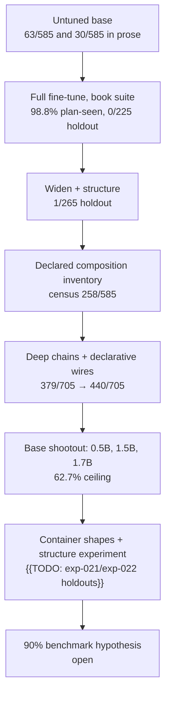

# Compiling Word Problems into Executable Plans: What a Small Model Learns, and Does Not

This is the working journal of the sopLang-llm research. It records a single, arm-by-arm fine-tuning series in which a small code-capable language model was taught to compile word problems into **SOP Lang** — a wire-based domain-specific language executed by a verified runtime — and to let that runtime own correctness. The article is written as a journal short paper, not a book: one hypothesis per lever, one number per claim, and every number is grounded in the evaluation registry and the shipped tooling that reproduces it.

The series is *unfinished by design*: two arms are still pending, and their numbers appear as `{{TODO: …}}` placeholders rather than invented figures. The prose is complete; the placeholders mark exactly where the next measured result lands.

## Reading order

1. `01-introduction.md` — the problem and why it is interesting: a small model that compiles, and a runtime that owns correctness.
2. `02-method.md` — the pipeline, the verification contract, the structural splits, the training recipe, and the chat surface.
3. `03-hypotheses.md` — the five measured hypotheses, each with its evidence.
4. `04-results.md` — the arm table, the wire-adoption figure, the bloat indicator, and the pending placeholders.
5. `05-discussion.md` — what is new, what remains open, and the operations honesty.
6. `06-reproducibility.md` — the open-source artifacts and the exact verification commands.

## The arc in one picture

## Conventions

- Every percentage carries its count (`62.7% (442/705)`), never a bare rate.
- The seven-class outcome ladder is fixed: `generation_transport_error`, `wrapper_rejected`, `parse_invalid`, `graph_invalid`, `execution_error`, `answer_mismatch`, `answer_match`. "Oracle match" is the last of these.
- A "plan" is a plan fingerprint: the `facts` body plus the compute structure. "Plan-seen" means the fingerprint occurred in the training rows; "plan-unseen" means it did not.
- Pending measurements are `{{TODO: description}}`. Nothing here is extrapolated into a number that was not measured.
