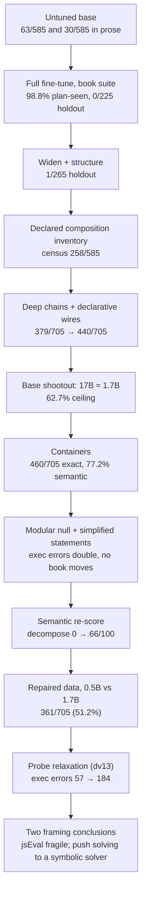

# Compiling Word Problems into Executable Plans: A Small Model, an Abstraction-Learning Loop, and a Comparator That Hid the Answer

> Historical working materials, superseded for publication by the [audited manuscript portfolio](../../article/README.md). The text below and the chapter/variant drafts retain unsupported interpretations, including a model-size misidentification and non-reconstructable semantic aggregates. They are preserved as provenance, not as an approved research account. Use the [correction ledger](../../article/audit/claim-ledger.md) and the manuscripts in `article/docs/` for current claims.

This is the publishable record of the sopLang-llm research: a single, arm-by-arm fine-tuning series in which a small code-capable language model was taught to compile word problems into **SOP Lang** — a wire-based domain-specific language executed by a verified runtime — and to let that runtime own correctness. The series was planned, run, and measured end to end by a coding agent, and the article treats that fact as part of the method: the loop, the gates, and the skills are themselves a reproducibility artifact.

The headline finding is not a size claim. It is that **a 1.7B model trained through the abstraction-learning loop beats the project's own 17B model on the reasoning books**: world-as-a-system 20/20 against 0/20, and decompose-to-solve 66/100 against 0/100, under a meaning-based scorer. The second finding is that the benchmark's original exact-phrase scorer was hiding computation — a competent writer computed ~18/20 holdout items but scored 2/20 — so every trained model was re-scored semantically, and the container arm rose from 65.2% to 77.2%.

The size-floor run is now measured: the 0.5B student (Qwen2.5-Coder-0.5B) on the repaired data reaches 361/705 (51.2%) exact and 370/705 (52.5%) semantic, with world-as-a-system 0/20 (all 20 rows failing as compile errors) and decompose-to-solve 0/100 — the loop multiplies capacity, it does not create it. One claim remains unproven by design: the symbolic-solver alternative (Prolog, Z3) is stated as a hypothesis, not a result.

Two framing conclusions close the paper (chapter 5). First, `jsEval` is the fragile part: hand-written JavaScript per problem concentrates the failures — execution errors jumped 57 → 184 when the probe idiom shifted — while the abstract container shape transferred to an entire book (world-as-a-system 0 → 20/20). Second, the next leap is to search for still-more-general abstractions and to avoid `jsEval`, pushing the actual solving into a symbolic solver rather than emitting custom code per problem. Chapter 5 also records, honestly, the six mistakes the coding agent made and what caught each.

## Reading order

1. `01-introduction.md` — the problem, the research question, and the comparison that frames the paper.
2. `02-method.md` — the abstraction-learning loop, the wire vocabulary, the verification contract, and the coding-agent procedure.
3. `03-hypotheses.md` — the five measured hypotheses, each with its evidence and verdict.
4. `04-results.md` — the measured arms, the container win, the modularity null, and the semantic re-score.
5. `05-discussion.md` — the benchmark finding, the common-sense cause and fix, what is and is not new, the six mistakes of the coding agent, and the two framing conclusions.
6. `06-reproducibility.md` — the repository, the gates, and the skills that make the loop repeatable.

## The arc in one picture

```mermaid
graph TD
  A["Untuned base<br/>63/585 and 30/585 in prose"] --> B["Full fine-tune, book suite<br/>98.8% plan-seen, 0/225 holdout"]
  B --> C["Widen + structure<br/>1/265 holdout"]
  C --> D["Declared composition inventory<br/>census 258/585"]
  D --> E["Deep chains + declarative wires<br/>379/705 &rarr; 440/705"]
  E --> F["Base shootout: 17B &asymp; 1.7B<br/>62.7% ceiling"]
  F --> G["Containers<br/>460/705 exact, 77.2% semantic"]
  G --> H["Modular null + simplified statements<br/>exec errors double, no book moves"]
  H --> I["Semantic re-score<br/>decompose 0 &rarr; 66/100"]
  I --> J["Repaired data, 0.5B vs 1.7B<br/>361/705 (51.2%)"]
  J --> K["Probe relaxation (dv13)<br/>exec errors 57 &rarr; 184"]
  K --> L["Two framing conclusions<br/>jsEval fragile; push solving to a symbolic solver"]
```

## Conventions

- Every percentage carries its count (`77.2% (544/705)`), never a bare rate.
- The seven-class outcome ladder is fixed: `generation_transport_error`, `wrapper_rejected`, `parse_invalid`, `graph_invalid`, `execution_error`, `answer_mismatch`, `answer_match`. "Oracle match" is the last of these.
- "Exact" scoring is the benchmark's original phrase-matcher; "semantic" scoring re-judges a failed item by meaning (same numbers and same verdict, wording ignored). Execution errors are never rescued by either scorer.
- A "plan" is a plan fingerprint: the `facts` body plus the compute structure. "Plan-seen" means the fingerprint occurred in the training rows; "plan-unseen" means it did not.
- The symbolic-solver alternative (Prolog, Z3) is a hypothesis, not a measured result; it is flagged as such wherever it appears. No measured figure in this article is extrapolated.
